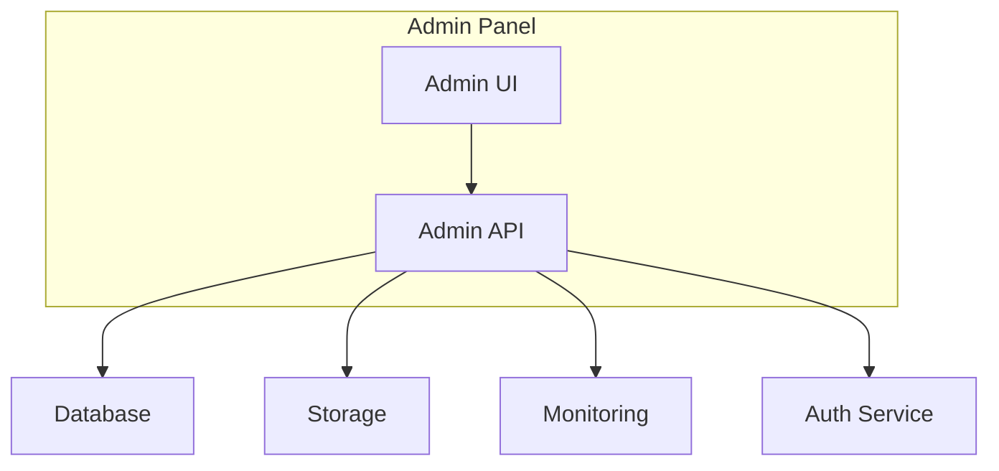

# Административная панель Moodboard

## Оглавление

- [Административная панель Moodboard](#административная-панель-moodboard)
  - [Оглавление](#оглавление)
  - [Обзор](#обзор)
  - [Функциональные возможности](#функциональные-возможности)
    - [Управление пользователями](#управление-пользователями)
    - [Управление контентом](#управление-контентом)
    - [Аналитика](#аналитика)
    - [Настройки системы](#настройки-системы)
  - [Архитектура](#архитектура)
    - [Основные компоненты](#основные-компоненты)
  - [Технологический стек](#технологический-стек)
    - [Frontend](#frontend)
    - [Backend](#backend)
    - [Инфраструктура](#инфраструктура)
  - [Безопасность](#безопасность)
  - [Интеграции](#интеграции)
  - [Мониторинг](#мониторинг)
  - [Логирование](#логирование)

## Обзор

Административная панель Moodboard предоставляет инструменты для управления платформой, мониторинга системы и анализа данных. Панель доступна только авторизованным пользователям с соответствующими правами доступа.

## Функциональные возможности

### Управление пользователями
- Просмотр и редактирование профилей пользователей
- Управление ролями и правами доступа
- Блокировка/разблокировка аккаунтов
- Просмотр активности пользователей

### Управление контентом
- Модерация созданных проектов
- Управление категориями и тегами
- Редактирование системных шаблонов
- Управление AI моделями

### Аналитика
- Просмотр статистики использования
- Анализ производительности системы
- Отслеживание ошибок и инцидентов
- Генерация отчетов

### Настройки системы
- Конфигурация параметров платформы
- Управление интеграциями
- Настройка уведомлений
- Управление бэкапами

## Архитектура

### Основные компоненты

1. **Admin UI**
   - Next.js 14 (App Router)
   - React Server Components
   - Tailwind CSS + Shadcn/ui
   - Data Tables
   - Charts and Analytics

2. **Admin API**
   - tRPC для type-safe API
   - Next.js API Routes
   - Role-based Access Control
   - Audit Logging

3. **Интеграции**
   - Vercel Postgres
   - Vercel Blob Storage
   - Vercel KV
   - Vercel Analytics

## Технологический стек

### Frontend
- **Framework**: Next.js 14
- **UI**: Tailwind CSS, Shadcn/ui
- **State Management**: Zustand
- **Forms**: React Hook Form + Zod
- **Data Fetching**: TanStack Query
- **Charts**: Recharts
- **Tables**: TanStack Table

### Backend
- **API**: tRPC, Next.js API Routes
- **Database**: PostgreSQL (Vercel Postgres)
- **Storage**: Vercel Blob Storage
- **Caching**: Vercel KV
- **Auth**: Next-Auth

### Инфраструктура
- **Hosting**: Vercel
- **CI/CD**: Vercel + GitHub Actions
- **Monitoring**: Vercel Analytics

## Безопасность

1. **Аутентификация**
   - Next-Auth с JWT
   - OAuth (Google)
   - 2FA поддержка

2. **Защита данных**
   - Шифрование данных в Vercel Postgres
   - Защищенное хранение файлов в Vercel Blob Storage
   - HTTPS для всех соединений

3. **Доступ**
   - Role-based Access Control
   - IP Whitelisting
   - Rate Limiting
   - Audit Logging

## Интеграции

1. **База данных**
   - Vercel Postgres для хранения данных
   - Vercel KV для кэширования

2. **Хранение файлов**
   - Vercel Blob Storage для медиафайлов

3. **Мониторинг**
   - Vercel Analytics для метрик
   - Sentry для отслеживания ошибок

## Мониторинг

1. **Метрики**
   - Vercel Analytics
   - Serverless Function Logs
   - Database Performance Metrics

2. **Алерты**
   - Error Tracking
   - Performance Monitoring
   - Resource Usage Alerts

3. **Логирование**
   - Centralized Logs
   - Structured Logging
   - Audit Trails

## Логирование

1. **Типы логов**
   - Аудит действий администратора
   - Ошибки системы
   - Изменения конфигурации
   - Доступ к данным

2. **Хранение логов**
   - Vercel Postgres для структурированных данных
   - Vercel Blob Storage для больших файлов

3. **Анализ логов**
   - Поиск и фильтрация
   - Визуализация трендов
   - Генерация отчетов

_Last updated: 2024-03-27_
