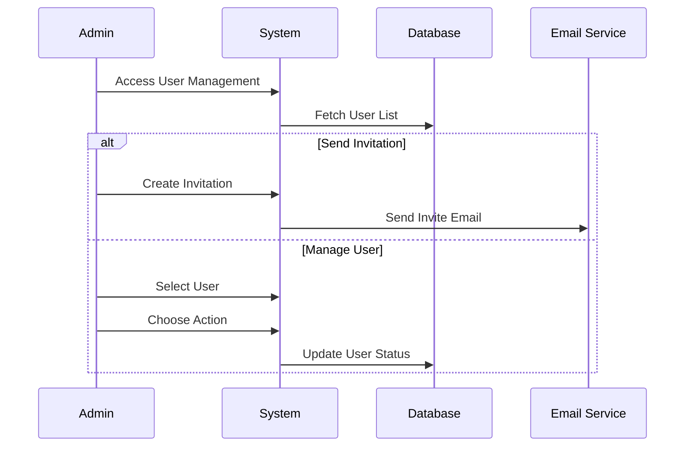
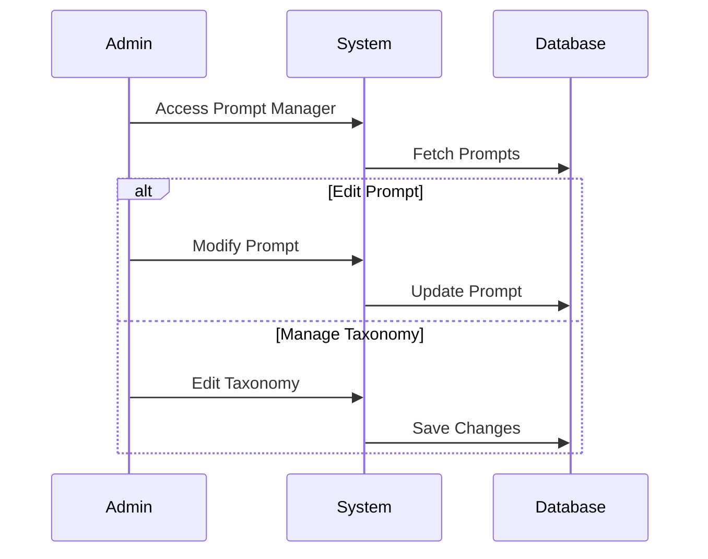
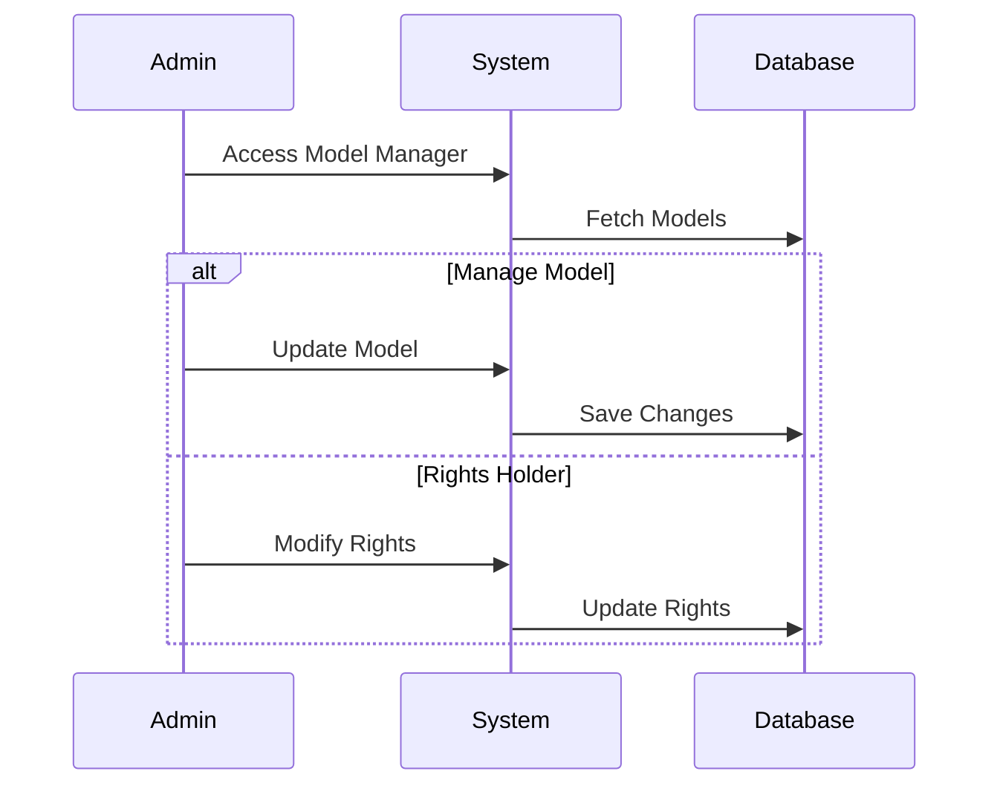
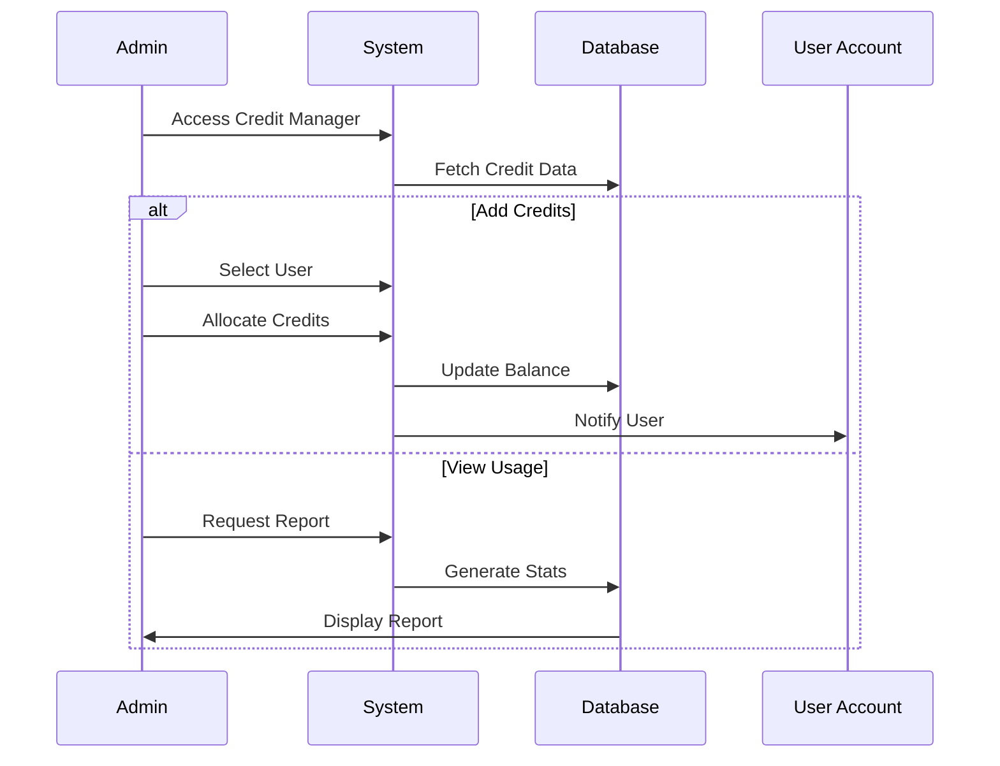
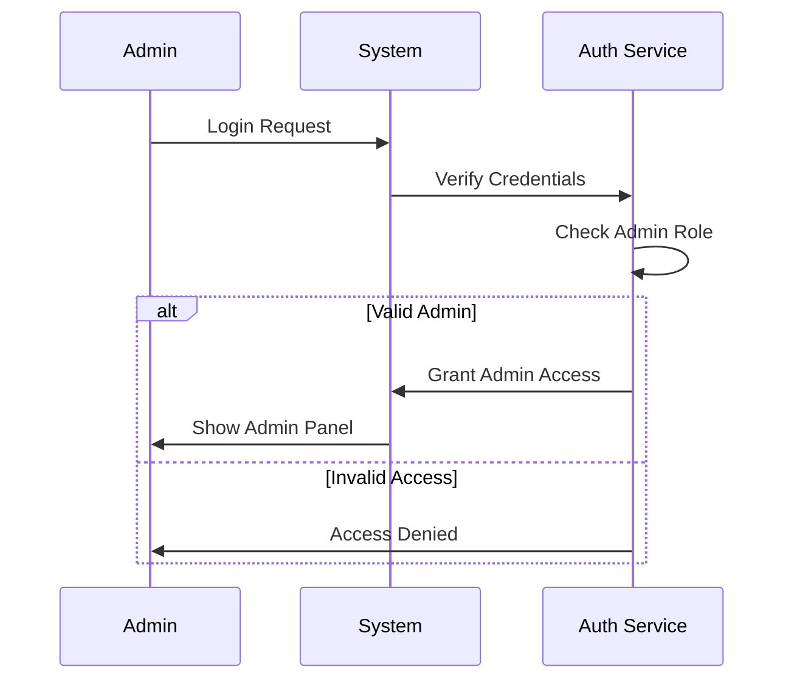

# Administrative Workflows

## Overview

This document describes administrative workflows in the Moodboard platform. The admin panel provides essential functionality for user management, content control, and resource allocation. The interface is designed to be straightforward and efficient, focusing on key administrative tasks.

## 1. User Management

User management provides administrators with tools to control user access and maintain the platform's user base.

### 1.1 User Access and Invitations

The invitation system allows controlled platform access through a simple invitation process. Administrators can manage users and send invitations directly from the admin panel.

**Core Features:**
- View complete user list
- Send individual invitations
- Block/unblock users
- Delete user accounts
- Basic user information viewing

## 2. Content Management

Content management allows administrators to control and maintain the platform's core content elements.

### 2.1 Prompt Management

Administrators can manage AI generation prompts and taxonomies to ensure quality and consistency of generated designs.

**Key Functions:**
- View and edit prompts
- Manage taxonomies
- Update prompt parameters
- Monitor prompt effectiveness

### 2.2 Model Management

Administrators can manage AI models and their respective rights holders.

**Core Features:**
- Add/remove AI models
- Manage model rights holders
- Update model parameters
- Monitor model usage

## 3. Resource Management

Resource management focuses on monitoring and controlling credit usage within the platform.

### 3.1 Credit Management

Administrators can view credit usage and allocate credits to users as needed.

**Key Functions:**
- View credit usage by user
- Add credits to user accounts
- Monitor overall credit consumption
- View credit history

## 4. Admin Authentication

Administrators access the admin panel through secure authentication while maintaining their regular user access.

**Process Features:**
- Secure admin login
- Role-based access control
- Session management
- Access logging

_Last updated: 2024-03-27_ 