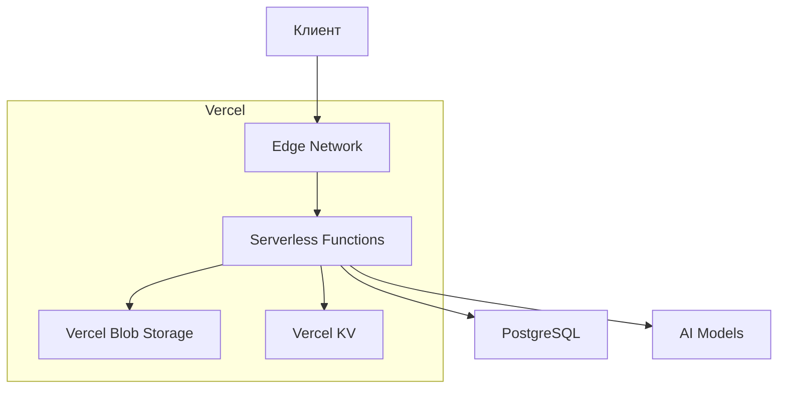
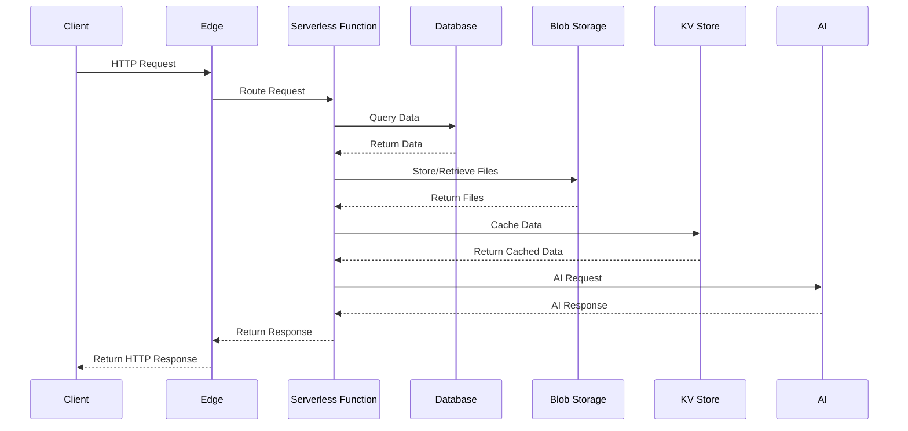

# Архитектура Moodboard

## Оглавление

- [Архитектура Moodboard](#архитектура-moodboard)
  - [Оглавление](#оглавление)
  - [Обзор](#обзор)
  - [Архитектурные принципы](#архитектурные-принципы)
  - [Компоненты системы](#компоненты-системы)
    - [Основные компоненты](#основные-компоненты)
  - [Технологический стек](#технологический-стек)
    - [Frontend](#frontend)
    - [Backend](#backend)
    - [Инфраструктура](#инфраструктура)
  - [Потоки данных](#потоки-данных)
  - [Масштабируемость](#масштабируемость)
  - [Безопасность](#безопасность)
  - [Мониторинг](#мониторинг)

## Обзор

Moodboard - это веб-платформа для создания дизайнов интерьеров с использованием AI. Архитектура построена на основе Vercel и Next.js, что обеспечивает высокую производительность, масштабируемость и простоту разработки.

## Архитектурные принципы

1. **Serverless-first**: Использование бессерверных функций Vercel для обработки запросов
2. **Edge Computing**: Распределенная обработка на edge-узлах Vercel
3. **Type Safety**: Полная типизация с использованием TypeScript
4. **Modularity**: Модульная структура компонентов
5. **Performance**: Оптимизация для быстрой загрузки и отклика

## Компоненты системы

### Основные компоненты

1. **Клиентское приложение**
   - Next.js 14 (App Router)
   - React Server Components
   - Tailwind CSS + Shadcn/ui

2. **Серверная часть**
   - Vercel Serverless Functions
   - tRPC для type-safe API
   - Next.js API Routes

3. **Хранение данных**
   - PostgreSQL (через Vercel Postgres)
   - Vercel Blob Storage для файлов
   - Vercel KV для кэширования

4. **AI интеграции**
   - OpenAI GPT-4 для текста
   - Replicate для генерации изображений
   - Локальные модели для базовой обработки

## Технологический стек

### Frontend
- **Framework**: Next.js 14
- **UI**: Tailwind CSS, Shadcn/ui
- **State Management**: Zustand
- **Forms**: React Hook Form + Zod
- **Data Fetching**: TanStack Query

### Backend
- **API**: tRPC, Next.js API Routes
- **Database**: PostgreSQL (Vercel Postgres)
- **Storage**: Vercel Blob Storage
- **Caching**: Vercel KV
- **Auth**: Next-Auth

### Инфраструктура
- **Hosting**: Vercel
- **CI/CD**: Vercel + GitHub Actions
- **Monitoring**: Vercel Analytics

## Потоки данных

## Масштабируемость

1. **Автомасштабирование**
   - Vercel автоматически масштабирует Serverless Functions
   - Vercel Postgres поддерживает автоматическое масштабирование

2. **Кэширование**
   - Vercel KV для кэширования данных
   - Edge Caching для статических ресурсов
   - ISR (Incremental Static Regeneration)

3. **Оптимизация**
   - Code Splitting
   - Lazy Loading
   - Image Optimization

## Безопасность

1. **Аутентификация**
   - Next-Auth с JWT
   - OAuth (Google)
   - 2FA поддержка

2. **Защита данных**
   - Шифрование данных в Vercel Postgres
   - Защищенное хранение файлов в Vercel Blob Storage
   - HTTPS для всех соединений

3. **Доступ**
   - Role-based Access Control
   - IP Whitelisting
   - Rate Limiting

## Мониторинг

1. **Метрики**
   - Vercel Analytics
   - Serverless Function Logs
   - Database Performance Metrics

2. **Алерты**
   - Error Tracking
   - Performance Monitoring
   - Resource Usage Alerts

3. **Логирование**
   - Centralized Logs
   - Structured Logging
   - Audit Trails

_Last updated: 2024-03-27_ 