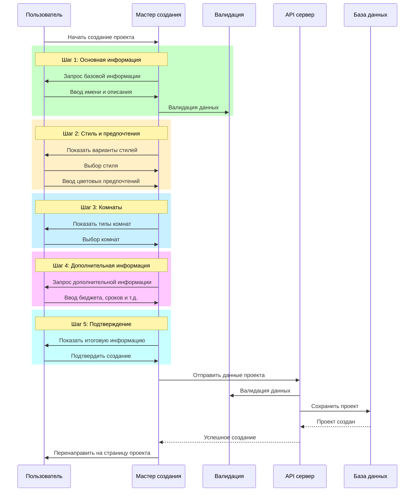

# Мастер создания проектов

## Обзор

Мастер создания проектов - это пошаговый интерфейс, который помогает пользователям создавать новые проекты дизайна интерьера в приложении Moodboard. Он разработан для сбора всей необходимой информации о проекте в интуитивно понятном и удобном формате.

## Структура мастера

Мастер состоит из пяти последовательных шагов:

1. **Основная информация** - базовые детали проекта
2. **Стиль и предпочтения** - выбор дизайнерского стиля и цветовых предпочтений
3. **Комнаты** - выбор комнат, которые будут включены в проект
4. **Дополнительная информация** - бюджет, сроки и особые требования
5. **Подтверждение** - обзор и подтверждение всех введенных данных

## Технические детали

Мастер реализован как многошаговая форма с использованием React и TypeScript. Состояние формы управляется локально с использованием хука `useState`. После завершения всех шагов данные отправляются через API для создания нового проекта.

### Основные компоненты
- `ProgressIndicator` - визуальный индикатор прогресса
- `Card` для каждого шага мастера
- Кнопки навигации между шагами

### Хранение состояния

```typescript
// Структура данных проекта
interface ProjectFormData {
  name: string;
  description: string;
  visibility: 'private' | 'public';
  designStyle: string;
  colorPreferences: string[];
  rooms: string[];
  budget?: string;
  timeline?: string;
  notes?: string;
}

// Шаги мастера
const STEPS = [
  { id: 'basic', title: 'Основная информация' },
  { id: 'style', title: 'Стиль и предпочтения' },
  { id: 'rooms', title: 'Комнаты' },
  { id: 'additional', title: 'Дополнительно' },
  { id: 'summary', title: 'Подтверждение' },
];
```

## Описание шагов

### 1. Основная информация

На этом шаге пользователь вводит базовую информацию о проекте:

- **Название проекта** (обязательное поле)
- **Описание** (опционально)
- **Видимость проекта** (приватный/публичный)

Валидация:
- Название проекта не может быть пустым
- Максимальная длина названия: 100 символов
- Максимальная длина описания: 500 символов

### 2. Стиль и предпочтения

На этом шаге пользователь выбирает визуальный стиль и цветовые предпочтения:

- **Основной стиль дизайна**:
  - Современный
  - Скандинавский
  - Минималистичный
  - Индустриальный
  - Классический
- **Цветовые предпочтения** (свободная форма)

### 3. Комнаты

На этом шаге пользователь выбирает комнаты, для которых будет создаваться дизайн:

- Гостиная
- Спальня
- Кухня
- (Будет расширен в будущих версиях)

Пользователь может выбрать несколько комнат.

### 4. Дополнительная информация

На этом шаге пользователь может указать:

- **Бюджет** (опционально)
- **Сроки реализации** (опционально)
- **Дополнительные пожелания и требования** (опционально)

### 5. Подтверждение

На этом шаге отображается вся введенная информация для финальной проверки перед созданием проекта.

## Процесс создания проекта



## Пользовательский опыт

Мастер создания проектов разработан с учетом следующих принципов UX:

1. **Прогрессивное раскрытие** - информация предоставляется пользователю постепенно, чтобы не перегружать его
2. **Визуальный прогресс** - индикатор прогресса показывает, на каком этапе находится пользователь
3. **Возможность возврата** - пользователь может вернуться к предыдущим шагам для редактирования
4. **Валидация ввода** - проверка данных в режиме реального времени
5. **Визуальная обратная связь** - выбранные элементы явно выделяются

## Будущие улучшения

Планируемые улучшения мастера создания проектов:

1. **Загрузка изображений-вдохновений**
2. **Предварительный просмотр результатов**
3. **Расширение типов комнат**
4. **Шаблоны проектов для быстрого старта**
5. **Интеграция с AI для рекомендаций**
6. **Сохранение прогресса создания и возможность продолжить позже**

## Интеграция

Мастер создания проектов интегрирован с API `/api/projects` для создания проектов и `/api/users/me/templates` для получения шаблонов пользователя.

## Дизайн и стилизация

Мастер использует компоненты дизайн-системы приложения:

- `Card` для шагов мастера
- `Button` для навигации
- `RadioGroup` для выбора опций
- Цветовая схема соответствует основному стилю приложения

## Связанные документы

- [Дизайн-система](/docs/design.md)
- [API-документация](/docs/api.md)
- [Рабочие процессы](/docs/workflow.md)
- [Пользовательские сценарии](/docs/user-workflows.md) 