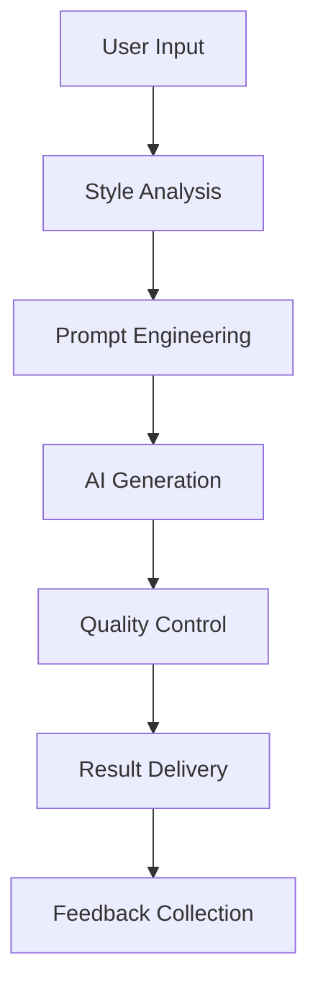

# Moodboard Project Documentation

## Table of Contents

- [Overview](#overview)
- [Core Objectives](#core-objectives)
  - [Priority 1: Core Features](#priority-1-core-features)
  - [Priority 2: Enhanced User Experience](#priority-2-enhanced-user-experience)
  - [Priority 3: Advanced Features](#priority-3-advanced-features)
  - [Priority 4: Platform Growth](#priority-4-platform-growth)
- [Room Classification Taxonomy](#room-classification-taxonomy)
- [Technical Implementation](#technical-implementation)
- [Development Roadmap](#development-roadmap)
- [Success Metrics](#success-metrics)
- [Risk Management](#risk-management)
- [Support and Maintenance](#support-and-maintenance)

## Overview

Moodboard is an innovative AI-driven platform that empowers architects, interior designers, and real estate professionals to effortlessly create stunning, visually cohesive moodboards. Simply input your concept or initial inspiration, and our AI will generate curated moodboards tailored specifically to your architectural style, interior preferences, or real estate marketing needs.

## Core Objectives

Our mission is to democratize interior design by making professional-grade tools accessible to architects, designers, and real estate professionals.

### Priority 1: Core Features

1. **Room/Space Classification System**
   - Implement a comprehensive 2-level taxonomy
   - Categories include: Kitchen, Living Room, Bedroom, Bathroom, etc.
   - Subcategories for detailed space classification
   - Smart tagging and organization system

2. **AI Image Generation**
   - Integration with state-of-the-art AI models
   - Multiple design variations per prompt
   - Style consistency across generations
   - Quality control and filtering

3. **User Authentication & Access Control**
   - Secure invitation-based registration
   - Email/Password and Google OAuth authentication
   - JWT-based session management
   - Role-based access control

4. **Feedback Collection System**
   - User rating system for generated designs
   - Qualitative feedback collection
   - Analytics dashboard for quality monitoring
   - Continuous improvement pipeline

5. **Resource Management**
   - Credit-based generation system
   - Usage limits and quotas
   - Pricing tier management
   - Resource allocation monitoring

### Priority 2: Enhanced User Experience

1. **Project Creation Wizard**
   - Step-by-step project setup
   - Style preference selection
   - Room type configuration
   - Budget consideration

2. **Multiple Options Generation**
   - Batch generation capability
   - Style variation controls
   - Color scheme alternatives
   - Layout variations

3. **Export Functionality**
   - Multiple format support (PDF/PNG/JPEG)
   - High-resolution exports
   - Miro/Figma integration
   - Batch export capability

4. **Image Scaling**
   - Resolution enhancement
   - Aspect ratio adjustment
   - Format conversion
   - Quality preservation

5. **History Browser**
   - Comprehensive project history
   - Version tracking
   - Generation timeline
   - Restore capabilities

### Priority 3: Advanced Features

1. **Collaboration Tools**
   - Real-time sharing
   - Comment system
   - Role-based permissions
   - Activity tracking

2. **Advanced Customization**
   - Style mixing
   - Color palette customization
   - Furniture placement
   - Lighting simulation

3. **Professional Tools**
   - Measurement tools
   - Cost estimation
   - Material selection
   - Vendor integration

4. **Analytics Dashboard**
   - Usage statistics
   - Generation metrics
   - Quality scores
   - User engagement

5. **Integration APIs**
   - Third-party plugins
   - Custom integrations
   - Webhook support
   - API documentation

### Priority 4: Platform Growth

1. **Marketplace Development**
   - Designer marketplace
   - Template sharing
   - Premium content
   - Revenue sharing

2. **Enterprise Features**
   - Team management
   - Bulk operations
   - Custom branding
   - Advanced security

## Room Classification Taxonomy

### Kitchen Spaces

- Layout and Spatial Design
  - Open-concept kitchen
  - Galley kitchen
  - U-shaped kitchen
  - L-shaped kitchen
  - Island kitchen
  - Peninsula kitchen

- Storage Solutions
  - Butler's pantry
  - Walk-in pantry
  - Hidden/secret pantry
  - Breakfast nook
  - Banquette seating
  - Bar seating

- Functional Areas
  - Double kitchen (separate prep & cooking areas)
  - Outdoor kitchen extension
  - Scullery kitchen (secondary clean-up area)

### Living Spaces

- Primary Living Areas
  - Main living room
  - Family room
  - Great room
  - Formal living room

- Specialty Spaces
  - Media room
  - Game room
  - Library/reading room
  - Sunroom

### Bedroom Spaces

- Primary Bedrooms
  - Master suite
  - En-suite bedroom
  - Walk-in closet
  - Sitting area

- Secondary Bedrooms
  - Guest bedroom
  - Children's room
  - Teen room
  - Home office conversion

## Technical Implementation

### AI Generation Pipeline

### System Architecture

- Next.js 14 App Router for frontend
- PostgreSQL with Prisma ORM
- AI service integrations (OpenAI, Replicate)
- Vercel Blob Storage for assets
- Vercel KV for caching
- tRPC for type-safe API communication
- WebSocket (Socket.io) for real-time updates
- Pusher for presence awareness
- Y.js for collaborative state management

### Performance Targets

- Page Load: < 2s
- Generation Time: < 15s
- API Response: < 500ms
- Uptime: 99.9%

## Development Roadmap

### Phase 1: MVP

- Core authentication system
- Basic room classification
- Initial AI integration
- Essential UI components

### Phase 2: Enhanced Features

- Advanced generation options
- Export functionality
- History system
- Feedback collection

### Phase 3: Professional Tools

- Collaboration features
- Advanced customization
- Analytics dashboard
- API development

### Phase 4: Scale & Growth

- Marketplace launch
- Enterprise features
- Advanced integrations
- Platform optimization

## Success Metrics

1. **User Engagement**
   - Daily active users
   - Generation count
   - Session duration
   - Return rate

2. **Quality Metrics**
   - Generation success rate
   - User satisfaction score
   - Feedback ratings
   - Error rates

3. **Business Metrics**
   - User acquisition cost
   - Revenue per user
   - Conversion rate
   - Churn rate

## Risk Management

1. **Technical Risks**
   - AI service reliability
   - Scalability challenges
   - Performance issues
   - Security vulnerabilities

2. **Business Risks**
   - Market competition
   - Cost management
   - User adoption
   - Regulatory compliance

## Support and Maintenance

1. **User Support**
   - Documentation
   - Tutorial system
   - Support tickets
   - Community forum

2. **System Maintenance**
   - Regular updates
   - Performance monitoring
   - Security patches
   - Backup systems

_Last updated: 2024-03-27
