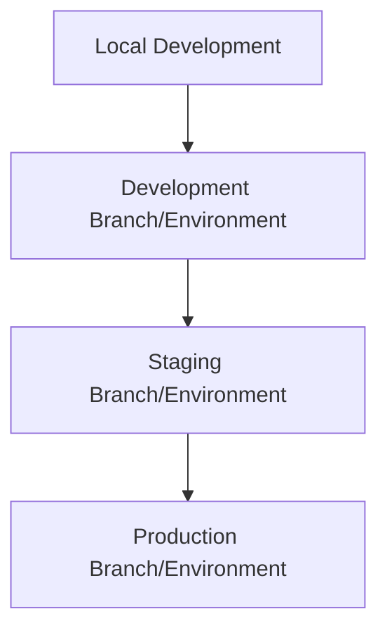

# Release Process Documentation

## Overview

This document describes the release process for the Moodboard project, including environment setup, deployment procedures, and rollback strategies.

## Table of Contents

- [Environment Structure](#environment-structure)
- [Infrastructure Setup](#infrastructure-setup)
- [Configuration](#configuration)
- [Deployment Process](#deployment-process)
- [Monitoring](#monitoring)
- [Rollback Procedures](#rollback-procedures)
- [Security Considerations](#security-considerations)

## Environment Structure

### Environment Hierarchy



### Database Structure (Neon)

```bash
project: moodboard
├── main (production)
│   └── endpoint: db.moodboard.cnstct.ai
├── staging
│   └── endpoint: staging-db.moodboard.cnstct.ai
└── development
    └── endpoint: dev-db.moodboard.cnstct.ai
```

## Infrastructure Setup

### 1. Vercel Project Setup

1. Create a new project in Vercel Dashboard or connect existing repository
2. Configure project settings:
   - Framework preset: Next.js
   - Build settings: `pnpm build`
   - Root directory: `src/moodboard`

### 2. Database and Storage Setup

#### Neon Database Integration

1. Navigate to your project in Vercel Dashboard
2. Go to the "Storage" tab
3. Click "Connect Database"
4. Select "Neon" under "Create New"
5. Follow the setup wizard:
   - Create new Neon account (if needed)
   - Select region
   - Choose plan
   - Set database name
6. Configure environments:
   - Production: Main branch
   - Preview: Automatically created for each PR
   - Development: Local development branch

#### Blob Storage Setup

1. In the same "Storage" tab
2. Click "Connect Storage"
3. Select "Blob Storage"
4. Create stores for each environment:
   - Production: `moodboard-prod`
   - Preview: Automatically managed by Vercel
   - Development: `moodboard-dev`

### 3. Environment Setup

```bash
# Pull environment variables locally
vercel env pull .env.local

# Variables will include:
# - POSTGRES_URL
# - BLOB_READ_WRITE_TOKEN
# - Other environment-specific variables
```

### 4. Domain Configuration

```bash
# Production domain
vercel domains add moodboard.com

# Preview domains are automatically managed by Vercel
```

## Configuration

### Environment Variables

```env
# .env.production
POSTGRES_URL="postgres://[user]:[password]@[prod-host]/[database]"
BLOB_READ_WRITE_TOKEN="prod_token"
ENVIRONMENT="production"

# .env.staging
POSTGRES_URL="postgres://[user]:[password]@[staging-host]/[database]"
BLOB_READ_WRITE_TOKEN="staging_token"
ENVIRONMENT="staging"

# .env.development
POSTGRES_URL="postgres://[user]:[password]@[dev-host]/[database]"
BLOB_READ_WRITE_TOKEN="dev_token"
ENVIRONMENT="development"
```

### Vercel Configuration

```json
{
  "git": {
    "deploymentEnabled": {
      "main": true,
      "staging": true,
      "development": true
    }
  },
  "environments": {
    "production": {
      "name": "moodboard",
      "url": "https://moodboard.com"
    },
    "preview": {
      "name": "moodboard-staging",
      "url": "https://staging.moodboard.com"
    },
    "development": {
      "name": "moodboard-dev",
      "url": "https://dev.moodboard.com"
    }
  }
}
```

## Deployment Process

### 1. Pre-deployment Checklist

- [ ] All tests passing
- [ ] No outstanding security vulnerabilities
- [ ] Database migrations prepared
- [ ] Environment variables configured
- [ ] Monitoring tools set up
- [ ] Rollback plan reviewed

### 2. Release Branch Creation

```bash
# Create release branch
git checkout -b release/v1.0.0 development

# Update version
npm version 1.0.0

# Review changes
git log development..release/v1.0.0
```

### 3. Staging Deployment

```bash
# Merge to staging
git checkout staging
git merge release/v1.0.0

# Deploy to staging
pnpm migrate:staging
pnpm deploy:staging

# Run tests
pnpm test:e2e --url=https://staging.moodboard.com
```

### 4. Production Deployment

```bash
# Merge to main
git checkout main
git merge release/v1.0.0

# Create release tag
git tag -a v1.0.0 -m "Release v1.0.0"

# Deploy to production
pnpm migrate:prod
pnpm deploy:prod
```

## Monitoring

### 1. Vercel Dashboard Monitoring

Access monitoring through Vercel Dashboard:
1. Navigate to your project
2. Go to "Analytics" tab for:
   - Web Vitals
   - User Experience
   - API Routes performance
3. Go to "Storage" tab for:
   - Database metrics
   - Blob Storage usage
   - Connection status

### 2. Key Metrics

#### Performance Metrics
- First Contentful Paint (FCP)
- Largest Contentful Paint (LCP)
- Time to Interactive (TTI)
- API Response Times
- Database Query Performance

#### Storage Metrics
- Database Connection Status
- Database Usage
- Blob Storage Usage
- Storage Costs

#### Deployment Metrics
- Build Success Rate
- Deployment Time
- Edge Function Performance
- Cache Hit Rates

### 3. Automated Monitoring

```typescript
// src/lib/monitoring.ts
import { headers } from 'next/headers';

export async function monitorEndpoint(endpoint: string) {
  try {
    const response = await fetch(endpoint, {
      headers: headers(),
      next: { revalidate: 60 } // Cache for 1 minute
    });
    
    if (!response.ok) {
      console.error(`Endpoint ${endpoint} returned ${response.status}`);
      // You can integrate with your error tracking service here
    }
    
    return response.ok;
  } catch (error) {
    console.error(`Failed to monitor ${endpoint}:`, error);
    return false;
  }
}
```

### 4. Alerts and Notifications

Configure alerts in Vercel Dashboard:
1. Go to Project Settings
2. Navigate to "Notifications"
3. Set up alerts for:
   - Failed deployments
   - Performance degradation
   - Storage usage thresholds
   - Error rate spikes

## Rollback Procedures

### 1. Database Rollback

```typescript
// scripts/rollback.ts
export const rollbackDatabase = async () => {
  await rollbackMigration(db, {
    migrationsFolder: './drizzle/migrations'
  });
};
```

### 2. Application Rollback

```bash
# Revert to previous version
vercel rollback --prod

# Verify rollback
vercel logs --tail
```

### 3. Post-Rollback Actions

- Notify team members
- Update status page
- Create incident report
- Schedule post-mortem

## Security Considerations

### 1. Environment Isolation

- Separate database branches for each environment
- Isolated blob storage instances
- Environment-specific API keys

### 2. Access Control

- Production access limited to senior team members
- Multi-factor authentication required
- Audit logging enabled

### 3. Data Protection

- Regular database backups
- Encryption at rest and in transit
- Personal data handling compliance

## Useful Commands

### Deployment

```bash
# Development deployment
pnpm deploy:dev

# Staging deployment
pnpm deploy:staging

# Production deployment
pnpm deploy:prod
```

### Database Operations

```bash
# Run migrations
pnpm migrate:prod

# Create backup
neonctl backup create --project moodboard-prod

# Restore backup
neonctl backup restore --project moodboard-prod --backup-id [id]
```

### Monitoring

```bash
# View logs
vercel logs --tail

# Check deployment status
vercel list deployments

# Monitor database metrics
neonctl metrics --project moodboard-prod
```

## Troubleshooting

### Common Issues

1. **Failed Migrations**
   - Check migration logs
   - Verify database connectivity
   - Review migration files

2. **Deployment Failures**
   - Check build logs
   - Verify environment variables
   - Review dependency versions

3. **Performance Issues**
   - Monitor database metrics
   - Check API response times
   - Review resource utilization

## Contact Information

- **DevOps Team**: devops@moodboard.com
- **Database Admin**: dba@moodboard.com
- **Security Team**: security@moodboard.com

## References

- [Vercel Documentation](https://vercel.com/docs)
- [Neon Documentation](https://neon.tech/docs)
- [Next.js Documentation](https://nextjs.org/docs) 