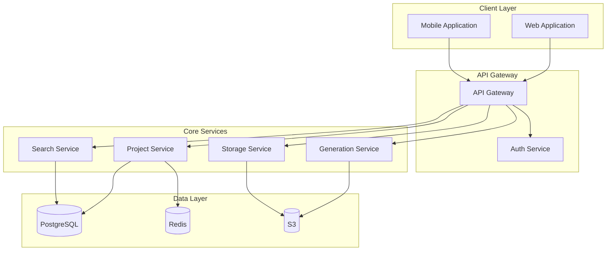
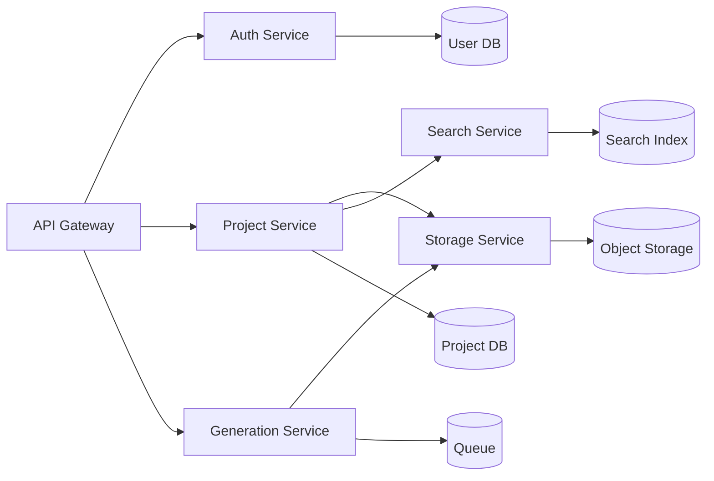
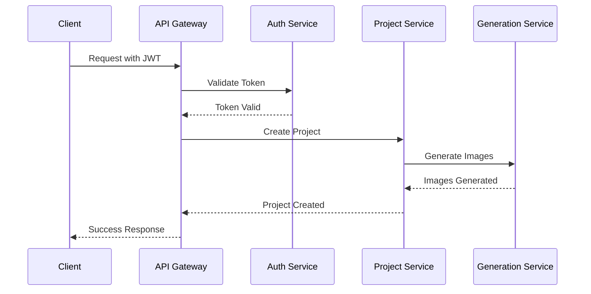
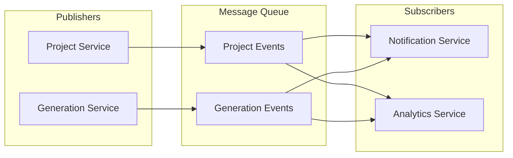
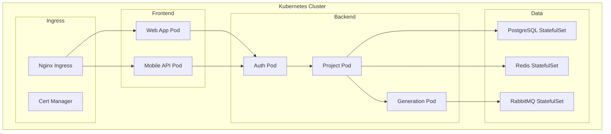
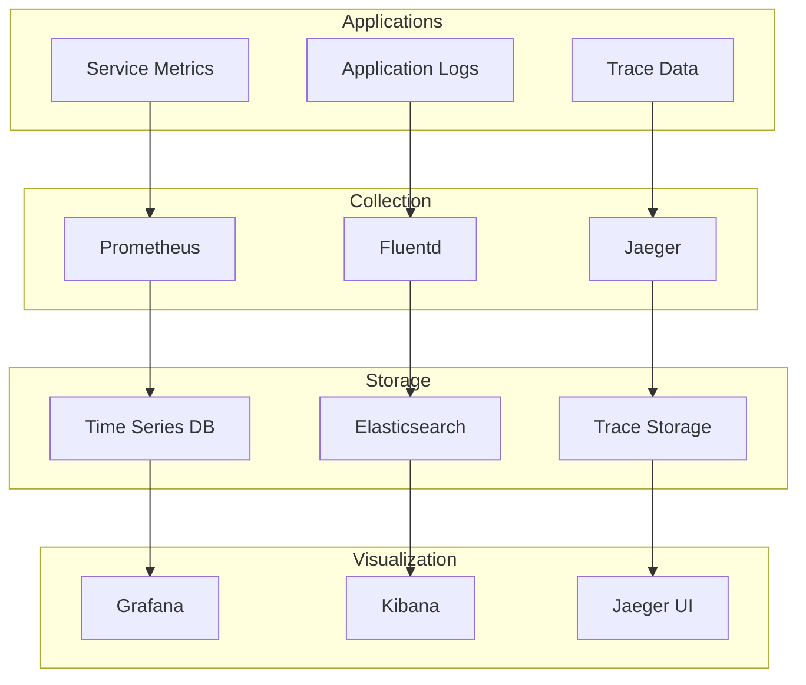
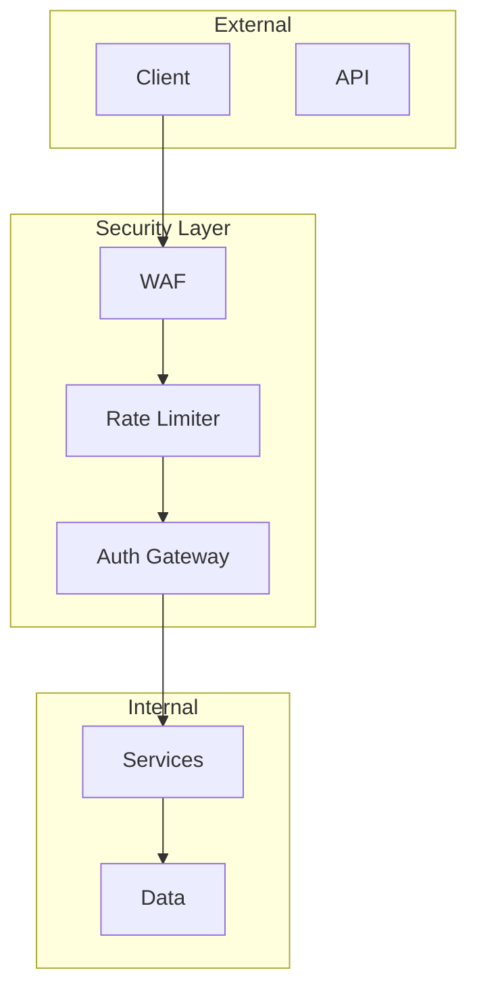
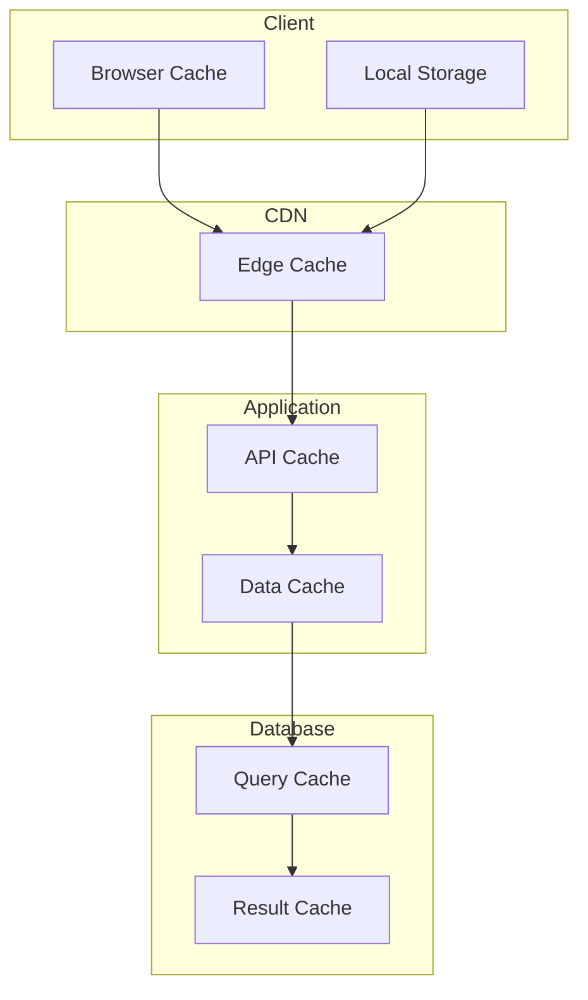

# External Services Integration

## Table of Contents

1. [Overview](#overview)
2. [Service Provider Pattern](#service-provider-pattern)
3. [Services Configuration](#services-configuration)
4. [Implemented Services](#implemented-services)
5. [Error Handling](#error-handling)

## Overview

Документация по интеграции и использованию внешних сервисов в проекте.

## Service Provider Pattern

### Base Provider Interface

```typescript
interface ServiceProvider<T extends BaseConfig, R extends BaseResponse> {
  initialize(config: T): Promise<void>;
  execute(params: unknown): Promise<R>;
  validateConfig(config: T): boolean;
  handleError(error: unknown): ServiceError;
}

interface BaseConfig {
  apiKey: string;
  apiUrl: string;
  timeout?: number;
  retryAttempts?: number;
}

interface BaseResponse {
  success: boolean;
  data?: unknown;
  error?: ServiceError;
}

class ServiceError extends Error {
  constructor(
    message: string,
    public code: string,
    public service: string,
    public originalError?: unknown
  ) {
    super(message);
  }
}
```

### Abstract Service Provider

```typescript
abstract class AbstractServiceProvider<T extends BaseConfig, R extends BaseResponse> 
  implements ServiceProvider<T, R> {
  
  protected config!: T;
  protected client: AxiosInstance;
  
  constructor() {
    this.client = axios.create();
  }

  async initialize(config: T): Promise<void> {
    if (!this.validateConfig(config)) {
      throw new ServiceError(
        'Invalid configuration',
        'CONFIG_ERROR',
        this.constructor.name
      );
    }
    this.config = config;
    this.setupClient();
  }

  protected setupClient(): void {
    this.client = axios.create({
      baseURL: this.config.apiUrl,
      timeout: this.config.timeout || 30000,
      headers: {
        'Authorization': `Bearer ${this.config.apiKey}`,
        'Content-Type': 'application/json'
      }
    });

    // Retry logic
    this.client.interceptors.response.use(
      response => response,
      async error => {
        const retryAttempts = this.config.retryAttempts || 3;
        let retryCount = 0;

        while (retryCount < retryAttempts) {
          try {
            return await this.client.request(error.config);
          } catch (retryError) {
            retryCount++;
            if (retryCount === retryAttempts) {
              throw retryError;
            }
            await new Promise(resolve => setTimeout(resolve, 1000 * retryCount));
          }
        }
      }
    );
  }

  abstract execute(params: unknown): Promise<R>;
  abstract validateConfig(config: T): boolean;
  
  handleError(error: unknown): ServiceError {
    if (error instanceof ServiceError) {
      return error;
    }
    
    if (axios.isAxiosError(error)) {
      return new ServiceError(
        error.message,
        error.response?.status.toString() || 'NETWORK_ERROR',
        this.constructor.name,
        error
      );
    }

    return new ServiceError(
      'Unknown error occurred',
      'UNKNOWN_ERROR',
      this.constructor.name,
      error
    );
  }
}
```

## Services Configuration

### Environment Variables

```env
# OpenAI Configuration
OPENAI_API_KEY=sk-...
OPENAI_API_URL=https://api.openai.com/v1
OPENAI_MODEL=gpt-4-vision-preview

# Replicate Configuration
REPLICATE_API_KEY=r8_...
REPLICATE_API_URL=https://api.replicate.com/v1

# Supabase Configuration
SUPABASE_URL=https://your-project.supabase.co
SUPABASE_ANON_KEY=eyJ...
SUPABASE_SERVICE_ROLE_KEY=eyJ...

# AWS Configuration
AWS_ACCESS_KEY_ID=AKIA...
AWS_SECRET_ACCESS_KEY=...
AWS_REGION=eu-central-1
AWS_S3_BUCKET=moodboard-assets
```

## Implemented Services

### OpenAI Integration

```typescript
interface OpenAIConfig extends BaseConfig {
  model: string;
  maxTokens?: number;
  temperature?: number;
}

interface OpenAIResponse extends BaseResponse {
  data?: {
    text?: string;
    images?: string[];
    usage?: {
      promptTokens: number;
      completionTokens: number;
      totalTokens: number;
    };
  };
}

class OpenAIProvider extends AbstractServiceProvider<OpenAIConfig, OpenAIResponse> {
  validateConfig(config: OpenAIConfig): boolean {
    return Boolean(
      config.apiKey &&
      config.apiUrl &&
      config.model
    );
  }

  async execute(params: {
    prompt: string;
    type: 'text' | 'image';
    n?: number;
  }): Promise<OpenAIResponse> {
    try {
      const endpoint = params.type === 'text' ? '/completions' : '/images/generations';
      
      const response = await this.client.post(endpoint, {
        model: this.config.model,
        messages: [{ role: 'user', content: params.prompt }],
        n: params.n || 1,
        max_tokens: this.config.maxTokens,
        temperature: this.config.temperature
      });

      return {
        success: true,
        data: {
          text: response.data.choices?.[0]?.message?.content,
          images: response.data.data?.map((img: { url: string }) => img.url),
          usage: response.data.usage
        }
      };
    } catch (error) {
      throw this.handleError(error);
    }
  }
}
```

### Replicate Integration

```typescript
interface ReplicateConfig extends BaseConfig {
  model: string;
  version: string;
}

interface ReplicateResponse extends BaseResponse {
  data?: {
    id: string;
    status: 'starting' | 'processing' | 'succeeded' | 'failed';
    output?: string[];
    error?: string;
  };
}

class ReplicateProvider extends AbstractServiceProvider<ReplicateConfig, ReplicateResponse> {
  validateConfig(config: ReplicateConfig): boolean {
    return Boolean(
      config.apiKey &&
      config.apiUrl &&
      config.model &&
      config.version
    );
  }

  async execute(params: {
    prompt: string;
    options?: Record<string, unknown>;
  }): Promise<ReplicateResponse> {
    try {
      const prediction = await this.client.post('/predictions', {
        version: this.config.version,
        input: {
          prompt: params.prompt,
          ...params.options
        }
      });

      // Poll for results
      const maxAttempts = 30;
      let attempts = 0;

      while (attempts < maxAttempts) {
        const status = await this.client.get(`/predictions/${prediction.data.id}`);
        
        if (status.data.status === 'succeeded') {
          return {
            success: true,
            data: {
              id: status.data.id,
              status: status.data.status,
              output: status.data.output
            }
          };
        }

        if (status.data.status === 'failed') {
          throw new Error(status.data.error);
        }

        attempts++;
        await new Promise(resolve => setTimeout(resolve, 2000));
      }

      throw new Error('Prediction timeout');
    } catch (error) {
      throw this.handleError(error);
    }
  }
}
```

### AWS S3 Integration

```typescript
interface AWSS3Config extends BaseConfig {
  region: string;
  bucket: string;
}

interface AWSS3Response extends BaseResponse {
  data?: {
    url?: string;
    key?: string;
    contentType?: string;
  };
}

class AWSS3Provider extends AbstractServiceProvider<AWSS3Config, AWSS3Response> {
  private s3: S3Client;

  validateConfig(config: AWSS3Config): boolean {
    return Boolean(
      config.apiKey &&
      config.region &&
      config.bucket
    );
  }

  async initialize(config: AWSS3Config): Promise<void> {
    await super.initialize(config);
    
    this.s3 = new S3Client({
      region: config.region,
      credentials: {
        accessKeyId: config.apiKey,
        secretAccessKey: config.apiUrl // Using apiUrl field for secret key
      }
    });
  }

  async execute(params: {
    file: Buffer | Readable;
    key: string;
    contentType: string;
  }): Promise<AWSS3Response> {
    try {
      const command = new PutObjectCommand({
        Bucket: this.config.bucket,
        Key: params.key,
        Body: params.file,
        ContentType: params.contentType
      });

      await this.s3.send(command);

      return {
        success: true,
        data: {
          url: `https://${this.config.bucket}.s3.${this.config.region}.amazonaws.com/${params.key}`,
          key: params.key,
          contentType: params.contentType
        }
      };
    } catch (error) {
      throw this.handleError(error);
    }
  }
}
```

## Error Handling

### Error Types

```typescript
enum ServiceErrorCode {
  CONFIG_ERROR = 'CONFIG_ERROR',
  NETWORK_ERROR = 'NETWORK_ERROR',
  API_ERROR = 'API_ERROR',
  RATE_LIMIT_ERROR = 'RATE_LIMIT_ERROR',
  TIMEOUT_ERROR = 'TIMEOUT_ERROR',
  VALIDATION_ERROR = 'VALIDATION_ERROR',
  UNKNOWN_ERROR = 'UNKNOWN_ERROR'
}

interface ServiceErrorDetails {
  code: ServiceErrorCode;
  message: string;
  service: string;
  timestamp: Date;
  requestId?: string;
  context?: Record<string, unknown>;
}
```

### Error Handling Strategy

```typescript
class ServiceErrorHandler {
  static async handle(
    error: ServiceError,
    context?: Record<string, unknown>
  ): Promise<void> {
    const errorDetails: ServiceErrorDetails = {
      code: error.code as ServiceErrorCode,
      message: error.message,
      service: error.service,
      timestamp: new Date(),
      context
    };

    // Log error
    await logger.error('Service error occurred', errorDetails);

    // Notify if critical
    if (this.isCriticalError(error)) {
      await this.notifyTeam(errorDetails);
    }

    // Store for analytics
    await this.storeError(errorDetails);
  }

  private static isCriticalError(error: ServiceError): boolean {
    return [
      ServiceErrorCode.CONFIG_ERROR,
      ServiceErrorCode.API_ERROR
    ].includes(error.code as ServiceErrorCode);
  }

  private static async notifyTeam(details: ServiceErrorDetails): Promise<void> {
    // Implement notification logic (e.g., Slack, email)
  }

  private static async storeError(details: ServiceErrorDetails): Promise<void> {
    // Store in database for analysis
  }
}
```

# Service Architecture Documentation

## Table of Contents

- [Overview](#overview)
- [System Architecture](#system-architecture)
- [Service Components](#service-components)
- [Communication Patterns](#communication-patterns)
- [Configuration Management](#configuration-management)
- [Deployment Strategy](#deployment-strategy)
- [Monitoring and Logging](#monitoring-and-logging)
- [Security Measures](#security-measures)
- [Performance Optimization](#performance-optimization)
- [Troubleshooting Guide](#troubleshooting-guide)

## Overview

The Moodboard platform implements a microservices architecture designed for scalability, reliability, and maintainability. This document outlines the service architecture, component interactions, and implementation details.

## System Architecture

### High-Level Architecture



### Service Dependencies



## Service Components

### Core Services

1. **API Gateway**
```typescript
// config/gateway.ts
interface GatewayConfig {
  port: number;
  cors: {
    origins: string[];
    methods: string[];
  };
  rateLimit: {
    window: number;
    max: number;
  };
  services: {
    auth: ServiceConfig;
    project: ServiceConfig;
    generation: ServiceConfig;
    storage: ServiceConfig;
    search: ServiceConfig;
  };
}

const gatewayConfig: GatewayConfig = {
  port: 3000,
  cors: {
    origins: ['https://*.moodboard.com'],
    methods: ['GET', 'POST', 'PUT', 'DELETE']
  },
  rateLimit: {
    window: 60000,
    max: 100
  },
  services: {
    auth: {
      url: 'http://auth-service:4000',
      timeout: 5000
    },
    project: {
      url: 'http://project-service:4001',
      timeout: 10000
    },
    generation: {
      url: 'http://generation-service:4002',
      timeout: 30000
    },
    storage: {
      url: 'http://storage-service:4003',
      timeout: 15000
    },
    search: {
      url: 'http://search-service:4004',
      timeout: 5000
    }
  }
};
```

2. **Auth Service**
```typescript
// config/auth.ts
interface AuthConfig {
  jwt: {
    secret: string;
    expiresIn: string;
  };
  providers: {
    google: OAuthConfig;
    github: OAuthConfig;
  };
  session: {
    store: 'redis' | 'memory';
    ttl: number;
  };
}

const authConfig: AuthConfig = {
  jwt: {
    secret: process.env.JWT_SECRET,
    expiresIn: '7d'
  },
  providers: {
    google: {
      clientId: process.env.GOOGLE_CLIENT_ID,
      clientSecret: process.env.GOOGLE_CLIENT_SECRET,
      callbackUrl: '/auth/google/callback'
    },
    github: {
      clientId: process.env.GITHUB_CLIENT_ID,
      clientSecret: process.env.GITHUB_CLIENT_SECRET,
      callbackUrl: '/auth/github/callback'
    }
  },
  session: {
    store: 'redis',
    ttl: 86400
  }
};
```

3. **Project Service**
```typescript
// config/project.ts
interface ProjectConfig {
  database: {
    url: string;
    pool: {
      min: number;
      max: number;
    };
  };
  cache: {
    url: string;
    ttl: number;
  };
  storage: {
    type: 's3' | 'local';
    bucket: string;
  };
}

const projectConfig: ProjectConfig = {
  database: {
    url: process.env.DATABASE_URL,
    pool: {
      min: 2,
      max: 10
    }
  },
  cache: {
    url: process.env.REDIS_URL,
    ttl: 3600
  },
  storage: {
    type: 's3',
    bucket: process.env.S3_BUCKET
  }
};
```

## Communication Patterns

### Service Communication Flow



### Event-Driven Architecture



## Configuration Management

### Environment Configuration

```yaml
# config/env/production.yaml
api:
  host: api.moodboard.com
  port: 443
  ssl: true

services:
  auth:
    url: http://auth-service:4000
    timeout: 5000
    retries: 3
  
  project:
    url: http://project-service:4001
    timeout: 10000
    retries: 2
    
  generation:
    url: http://generation-service:4002
    timeout: 30000
    retries: 1
    
  storage:
    url: http://storage-service:4003
    timeout: 15000
    retries: 3

database:
  master:
    host: db-master.moodboard.com
    port: 5432
    database: moodboard
    user: ${DB_USER}
    password: ${DB_PASSWORD}
    pool:
      min: 2
      max: 10
  
  replica:
    host: db-replica.moodboard.com
    port: 5432
    database: moodboard
    user: ${DB_USER}
    password: ${DB_PASSWORD}
    pool:
      min: 2
      max: 5

cache:
  redis:
    host: redis.moodboard.com
    port: 6379
    password: ${REDIS_PASSWORD}
    db: 0

storage:
  s3:
    bucket: moodboard-production
    region: us-east-1
    accessKey: ${AWS_ACCESS_KEY}
    secretKey: ${AWS_SECRET_KEY}

queue:
  rabbitmq:
    host: rabbitmq.moodboard.com
    port: 5672
    user: ${RABBITMQ_USER}
    password: ${RABBITMQ_PASSWORD}
    vhost: /

monitoring:
  datadog:
    apiKey: ${DATADOG_API_KEY}
    appKey: ${DATADOG_APP_KEY}
    service: moodboard
    env: production
```

## Deployment Strategy

### Container Orchestration



### Deployment Configuration

```yaml
# kubernetes/production/api-gateway.yaml
apiVersion: apps/v1
kind: Deployment
metadata:
  name: api-gateway
  namespace: production
spec:
  replicas: 3
  selector:
    matchLabels:
      app: api-gateway
  template:
    metadata:
      labels:
        app: api-gateway
    spec:
      containers:
      - name: api-gateway
        image: moodboard/api-gateway:latest
        ports:
        - containerPort: 3000
        env:
        - name: NODE_ENV
          value: production
        - name: PORT
          value: "3000"
        resources:
          requests:
            memory: "256Mi"
            cpu: "200m"
          limits:
            memory: "512Mi"
            cpu: "500m"
        livenessProbe:
          httpGet:
            path: /health
            port: 3000
          initialDelaySeconds: 30
          periodSeconds: 10
        readinessProbe:
          httpGet:
            path: /ready
            port: 3000
          initialDelaySeconds: 5
          periodSeconds: 5
```

## Monitoring and Logging

### Monitoring Architecture



### Monitoring Configuration

```yaml
# config/monitoring/prometheus.yml
global:
  scrape_interval: 15s
  evaluation_interval: 15s

scrape_configs:
  - job_name: 'api-gateway'
    static_configs:
      - targets: ['api-gateway:3000']
    
  - job_name: 'auth-service'
    static_configs:
      - targets: ['auth-service:4000']
    
  - job_name: 'project-service'
    static_configs:
      - targets: ['project-service:4001']
    
  - job_name: 'generation-service'
    static_configs:
      - targets: ['generation-service:4002']
```

## Security Measures

### Security Architecture



### Security Configuration

```typescript
// config/security.ts
interface SecurityConfig {
  cors: {
    origins: string[];
    methods: string[];
    headers: string[];
  };
  rateLimit: {
    window: number;
    max: number;
    whitelist: string[];
  };
  helmet: {
    hsts: boolean;
    noSniff: boolean;
    frameGuard: boolean;
  };
  jwt: {
    algorithm: string;
    expiresIn: string;
    refreshIn: string;
  };
}

const securityConfig: SecurityConfig = {
  cors: {
    origins: ['https://*.moodboard.com'],
    methods: ['GET', 'POST', 'PUT', 'DELETE'],
    headers: ['Authorization', 'Content-Type']
  },
  rateLimit: {
    window: 60000,
    max: 100,
    whitelist: ['127.0.0.1']
  },
  helmet: {
    hsts: true,
    noSniff: true,
    frameGuard: true
  },
  jwt: {
    algorithm: 'RS256',
    expiresIn: '1h',
    refreshIn: '7d'
  }
};
```

## Performance Optimization

### Caching Strategy



### Cache Configuration

```typescript
// config/cache.ts
interface CacheConfig {
  client: {
    maxAge: number;
    staleWhileRevalidate: number;
  };
  cdn: {
    ttl: number;
    purgeOnUpdate: boolean;
  };
  application: {
    redis: {
      host: string;
      port: number;
      db: number;
    };
    policies: {
      [key: string]: {
        ttl: number;
        maxSize: number;
      };
    };
  };
}

const cacheConfig: CacheConfig = {
  client: {
    maxAge: 3600,
    staleWhileRevalidate: 300
  },
  cdn: {
    ttl: 86400,
    purgeOnUpdate: true
  },
  application: {
    redis: {
      host: process.env.REDIS_HOST,
      port: 6379,
      db: 0
    },
    policies: {
      projects: {
        ttl: 3600,
        maxSize: 1000
      },
      generations: {
        ttl: 7200,
        maxSize: 500
      }
    }
  }
};
```

## Troubleshooting Guide

### Common Issues and Solutions

1. **Service Connection Issues**
```typescript
// utils/connection.ts
interface ConnectionCheck {
  service: string;
  status: 'up' | 'down';
  latency: number;
  lastError?: string;
}

async function checkServiceConnections(): Promise<ConnectionCheck[]> {
  const services = ['auth', 'project', 'generation', 'storage'];
  return Promise.all(
    services.map(async (service) => {
      try {
        const start = Date.now();
        await axios.get(`${serviceConfig[service].url}/health`);
        return {
          service,
          status: 'up',
          latency: Date.now() - start
        };
      } catch (error) {
        return {
          service,
          status: 'down',
          latency: -1,
          lastError: error.message
        };
      }
    })
  );
}
```

2. **Performance Monitoring**
```typescript
// utils/performance.ts
interface PerformanceMetrics {
  cpu: number;
  memory: number;
  requests: {
    total: number;
    failed: number;
    latency: number;
  };
  database: {
    connections: number;
    queryTime: number;
  };
}

async function gatherPerformanceMetrics(): Promise<PerformanceMetrics> {
  const metrics = {
    cpu: process.cpuUsage(),
    memory: process.memoryUsage(),
    requests: await getRequestMetrics(),
    database: await getDatabaseMetrics()
  };
  
  return metrics;
}
```

3. **Error Handling**
```typescript
// utils/error-handler.ts
interface ErrorResponse {
  code: string;
  message: string;
  details?: any;
  stack?: string;
}

function handleServiceError(error: any): ErrorResponse {
  if (error.isAxiosError) {
    return {
      code: 'SERVICE_ERROR',
      message: 'Service communication error',
      details: {
        service: error.config.url,
        status: error.response?.status
      }
    };
  }
  
  if (error.isDatabase) {
    return {
      code: 'DATABASE_ERROR',
      message: 'Database operation failed',
      details: {
        operation: error.operation,
        table: error.table
      }
    };
  }
  
  return {
    code: 'INTERNAL_ERROR',
    message: 'Internal server error',
    stack: process.env.NODE_ENV === 'development' ? error.stack : undefined
  };
}
```

_Last updated: 2024-03-27_