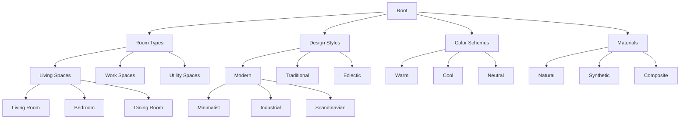
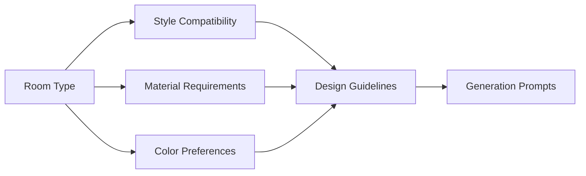
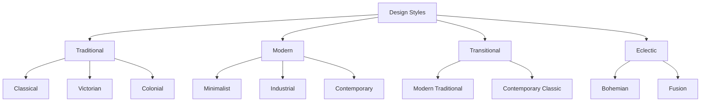
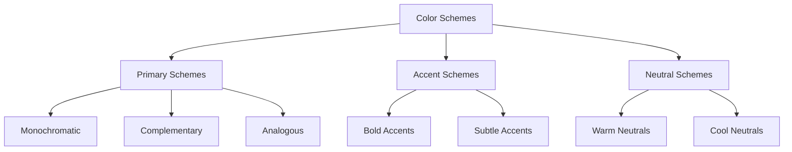
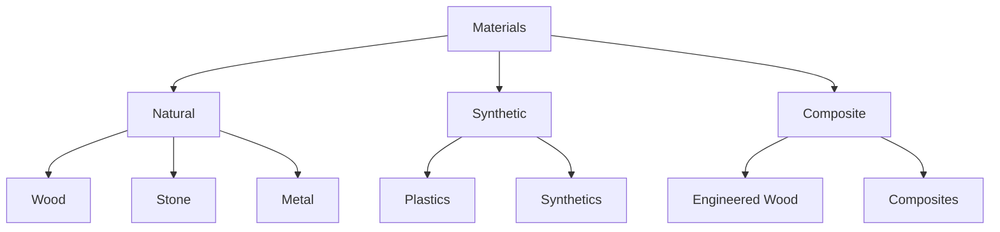

# Taxonomy Documentation

## Table of Contents

- [Overview](#overview)
- [Taxonomy Structure](#taxonomy-structure)
- [Room Types](#room-types)
- [Design Styles](#design-styles)
- [Color Schemes](#color-schemes)
- [Materials](#materials)
- [Usage Examples](#usage-examples)
- [Integration Guide](#integration-guide)
- [Best Practices](#best-practices)

## Overview

The Moodboard platform uses a hierarchical taxonomy system to classify and organize various aspects of interior design. This document describes the taxonomy structure, relationships, and implementation guidelines.

## Taxonomy Structure

### Hierarchical Organization



### Category Relationships



## Room Types

### Living Spaces

#### Living Room

```json
{
  "type": "living_room",
  "attributes": {
    "size_range": ["small", "medium", "large"],
    "functions": ["relaxation", "entertainment", "socializing"],
    "key_elements": ["seating", "lighting", "storage", "focal_point"]
  },
  "style_compatibility": {
    "high": ["modern", "traditional", "transitional"],
    "medium": ["industrial", "bohemian"],
    "low": ["minimalist"]
  },
  "common_materials": [
    "wood",
    "fabric",
    "metal",
    "glass"
  ],
  "color_schemes": {
    "recommended": ["neutral", "warm", "earth_tones"],
    "optional": ["bold", "monochromatic"]
  }
}
```

#### Example Usage

```typescript
// Room type selection with style matching
const roomConfig = {
  type: 'living_room',
  size: 'medium',
  style: 'modern',
  functions: ['entertainment', 'relaxation']
};

// Validate compatibility
const compatibility = await validateStyleCompatibility(roomConfig);
// Returns: { score: 0.85, recommendations: [...] }

// Get recommended materials
const materials = await getRecommendedMaterials(roomConfig);
// Returns: [{ id: 'wood', confidence: 0.9 }, ...]
```

## Design Styles

### Style Categories



### Style Attributes

#### Modern Style

```json
{
  "style": "modern",
  "characteristics": {
    "lines": "clean",
    "colors": "neutral",
    "textures": "smooth",
    "materials": ["metal", "glass", "concrete"]
  },
  "principles": [
    "form follows function",
    "minimalism",
    "open spaces"
  ],
  "common_elements": [
    "geometric shapes",
    "monochromatic palette",
    "minimal decoration"
  ],
  "room_compatibility": {
    "living_room": 0.9,
    "kitchen": 0.85,
    "bathroom": 0.8
  }
}
```

#### Example Usage

```typescript
// Style application with room type
const styleConfig = {
  style: 'modern',
  room_type: 'living_room',
  preferences: {
    colors: ['neutral', 'monochrome'],
    materials: ['metal', 'glass']
  }
};

// Generate style guidelines
const guidelines = await generateStyleGuidelines(styleConfig);
// Returns: { elements: [...], colors: [...], materials: [...] }

// Validate style consistency
const consistency = await validateStyleConsistency(styleConfig);
// Returns: { score: 0.92, suggestions: [...] }
```

## Color Schemes

### Color Organization



### Color Relationships

```json
{
  "scheme": "modern_neutral",
  "base_colors": [
    {
      "name": "off_white",
      "hex": "#F5F5F5",
      "usage": "walls",
      "proportion": 0.6
    },
    {
      "name": "warm_gray",
      "hex": "#808080",
      "usage": "furniture",
      "proportion": 0.3
    }
  ],
  "accent_colors": [
    {
      "name": "charcoal",
      "hex": "#36454F",
      "usage": "details",
      "proportion": 0.1
    }
  ],
  "combinations": [
    {
      "name": "modern_minimal",
      "colors": ["#F5F5F5", "#808080", "#36454F"],
      "ratio": "60-30-10"
    }
  ]
}
```

## Materials

### Material Categories



### Material Properties

```json
{
  "material": "engineered_wood",
  "properties": {
    "durability": 0.8,
    "cost": "medium",
    "maintenance": "low",
    "sustainability": 0.7
  },
  "applications": [
    "flooring",
    "furniture",
    "wall_panels"
  ],
  "style_compatibility": {
    "modern": 0.9,
    "traditional": 0.6,
    "industrial": 0.7
  },
  "combinations": [
    {
      "material": "metal",
      "compatibility": 0.9,
      "common_uses": ["furniture", "accents"]
    }
  ]
}
```

## Usage Examples

### Room Design Process

1. **Room Type Selection**
```typescript
const room = await taxonomyService.getRoomType('living_room');
const requirements = room.getRequirements();
```

2. **Style Matching**
```typescript
const style = await taxonomyService.findCompatibleStyles(room, {
  preferences: ['modern', 'minimal'],
  constraints: ['budget', 'space']
});
```

3. **Material Selection**
```typescript
const materials = await taxonomyService.getMaterialRecommendations({
  room,
  style,
  budget: 'medium',
  durability: 'high'
});
```

4. **Color Scheme Generation**
```typescript
const colorScheme = await taxonomyService.generateColorScheme({
  style,
  materials,
  preferences: {
    base: 'neutral',
    accent: 'bold'
  }
});
```

### Integration Examples

1. **API Integration**
```typescript
// Fetch taxonomy data
const taxonomy = await api.getTaxonomy({
  type: 'room',
  include: ['styles', 'materials', 'colors']
});

// Apply filters
const filtered = taxonomy.filter({
  style: 'modern',
  budget: 'medium',
  space: 'small'
});

// Generate recommendations
const recommendations = await api.getRecommendations(filtered);
```

2. **UI Components**
```typescript
// Room type selector
const RoomTypeSelector = () => {
  const [selected, setSelected] = useState(null);
  const types = useTaxonomy('room_types');
  
  return (
    <Select
      options={types}
      value={selected}
      onChange={handleRoomTypeChange}
      renderOption={renderRoomTypeOption}
    />
  );
};

// Style compatibility checker
const StyleCompatibility = ({ room, style }) => {
  const compatibility = useStyleCompatibility(room, style);
  
  return (
    <CompatibilityIndicator
      score={compatibility.score}
      recommendations={compatibility.recommendations}
    />
  );
};
```

## Best Practices

1. **Taxonomy Updates**
   - Regular review of categories
   - Version control for changes
   - Backward compatibility
   - Migration strategies

2. **Performance Optimization**
   - Cache taxonomy data
   - Lazy load subcategories
   - Optimize queries
   - Use efficient data structures

3. **Validation Rules**
   - Style compatibility checks
   - Material combination validation
   - Color scheme harmony
   - Room type constraints

4. **Error Handling**
   - Invalid combinations
   - Missing categories
   - Compatibility conflicts
   - Update failures

_Last updated: 2024-03-27_