# Technical Workflows

## Table of Contents

- [Overview](#overview)
- [1. AI Generation Pipeline](#1-ai-generation-pipeline)
  - [1.1 Image Generation Process](#11-image-generation-process)
  - [1.2 Prompt Engineering](#12-prompt-engineering)
- [2. Data Management](#2-data-management)
  - [2.1 Database Operations](#21-database-operations)
  - [2.2 Asset Management](#22-asset-management)
- [3. System Integration](#3-system-integration)
  - [3.1 External Service Integration](#31-external-service-integration)
  - [3.2 Authentication Flow](#32-authentication-flow)
- [4. Performance Optimization](#4-performance-optimization)
  - [4.1 Caching Strategy](#41-caching-strategy)
  - [4.2 Performance Monitoring](#42-performance-monitoring)
- [5. Development Workflow](#5-development-workflow)
  - [5.1 CI/CD Pipeline](#51-cicd-pipeline)
  - [5.2 Feature Development](#52-feature-development)
- [6. Security Implementation](#6-security-implementation)
  - [6.1 Request Security](#61-request-security)
  - [6.2 Data Security](#62-data-security)
- [7. Real-time Collaboration](#7-real-time-collaboration)
  - [7.1 Presence System](#71-presence-system)
  - [7.2 State Synchronization](#72-state-synchronization)

## Overview

This document describes technical workflows in the Moodboard platform, focusing on system architecture, development processes, and technical implementations. These workflows are designed to ensure reliable platform operation, scalable architecture, and efficient development processes.

## 1. AI Generation Pipeline

The AI generation pipeline is the core technology that powers the platform's design generation capabilities. It combines advanced AI models with quality control systems to produce high-quality design outputs.

### 1.1 Image Generation Process

The image generation process transforms user requirements into visually appealing and practical design solutions through a sophisticated AI pipeline.

**Business Impact:**
- Rapid design generation
- Consistent quality output
- Resource optimization
- Scalable solution delivery

**Process Benefits:**
- Automated design creation
- Quality-controlled output
- Resource efficiency
- User satisfaction

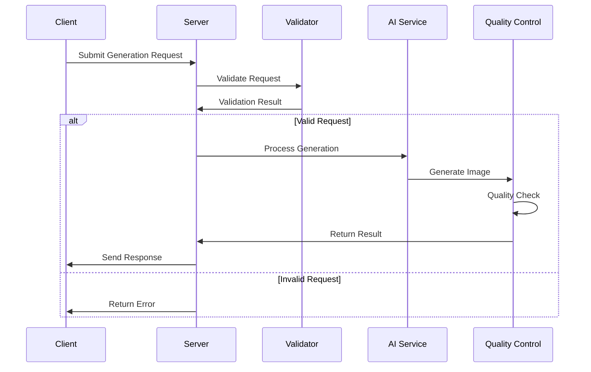

### 1.2 Prompt Engineering

The prompt engineering system ensures accurate translation of user requirements into AI-compatible instructions, maximizing generation quality and relevance.

**System Value:**
- Accurate requirement translation
- Improved generation quality
- Consistent output
- Enhanced user satisfaction

**Key Features:**
- Dynamic prompt generation
- Context awareness
- Quality optimization
- Style consistency

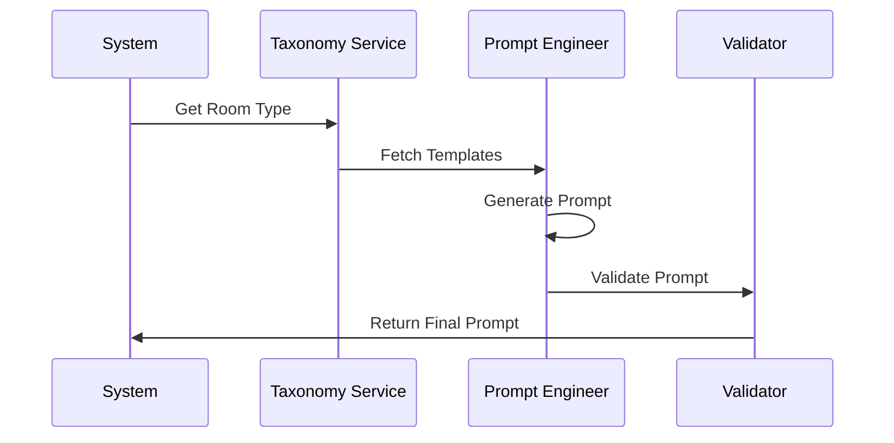

## 2. Data Management

Data management ensures efficient storage, retrieval, and processing of platform data while maintaining performance and security.

### 2.1 Database Operations

The database operations system optimizes data access and storage while ensuring data integrity and system performance.

**Operational Benefits:**
- Fast data access
- Reliable storage
- Efficient queries
- Scalable architecture

**Performance Features:**
- Query optimization
- Cache management
- Data integrity
- Performance monitoring

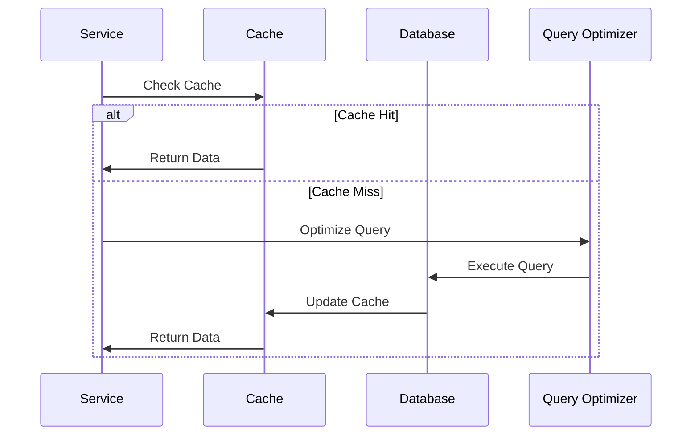

### 2.2 Asset Management

Asset management handles the storage and delivery of digital assets, ensuring efficient access and optimal performance.

**Business Value:**
- Fast asset delivery
- Storage optimization
- Cost efficiency
- Global accessibility

**System Features:**
- CDN integration
- Asset optimization
- Version control
- Access management

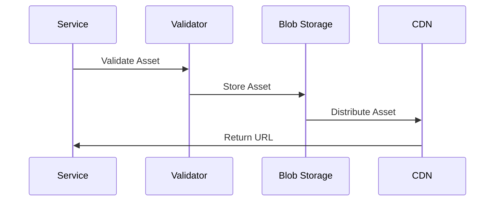

## 3. System Integration

System integration enables seamless connection with external services and maintains robust internal communication.

### 3.1 External Service Integration

The external service integration system manages connections with third-party services while ensuring reliability and security.

**Integration Benefits:**
- Extended functionality
- Service reliability
- Error handling
- Performance monitoring

**Key Capabilities:**
- Service connectivity
- Error recovery
- Performance tracking
- Security compliance

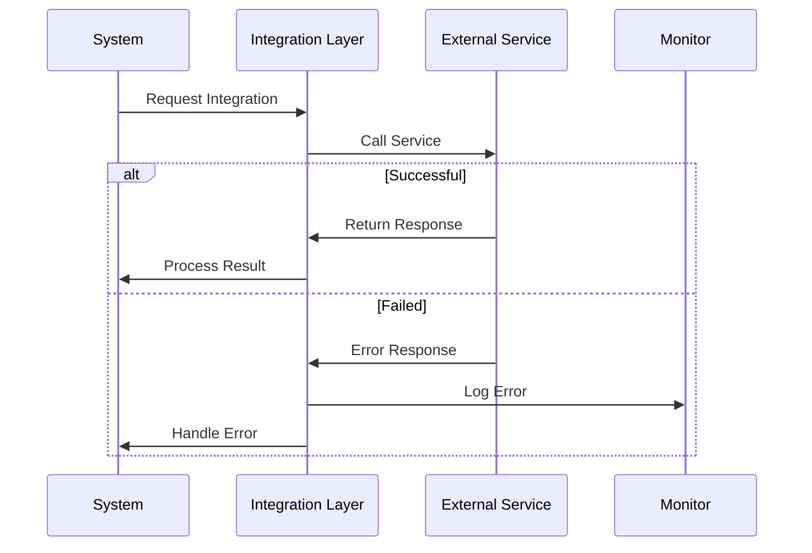

### 3.2 Authentication Flow

The authentication flow ensures secure user access while providing a seamless login experience across the platform.

**Security Benefits:**
- Secure access control
- User data protection
- Session management
- Fraud prevention

**User Experience:**
- Seamless authentication
- Multiple login options
- Session persistence
- Quick access recovery

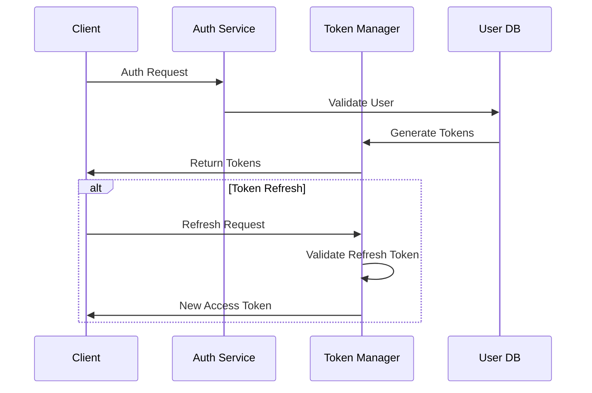

## 4. Performance Optimization

Performance optimization ensures fast and reliable platform operation through efficient resource utilization and caching strategies.

### 4.1 Caching Strategy

The caching strategy improves system performance and reduces resource usage through intelligent data caching.

**Performance Benefits:**
- Faster response times
- Reduced server load
- Better user experience
- Cost efficiency

**Implementation Features:**
- Multi-level caching
- Smart invalidation
- Resource optimization
- Performance monitoring

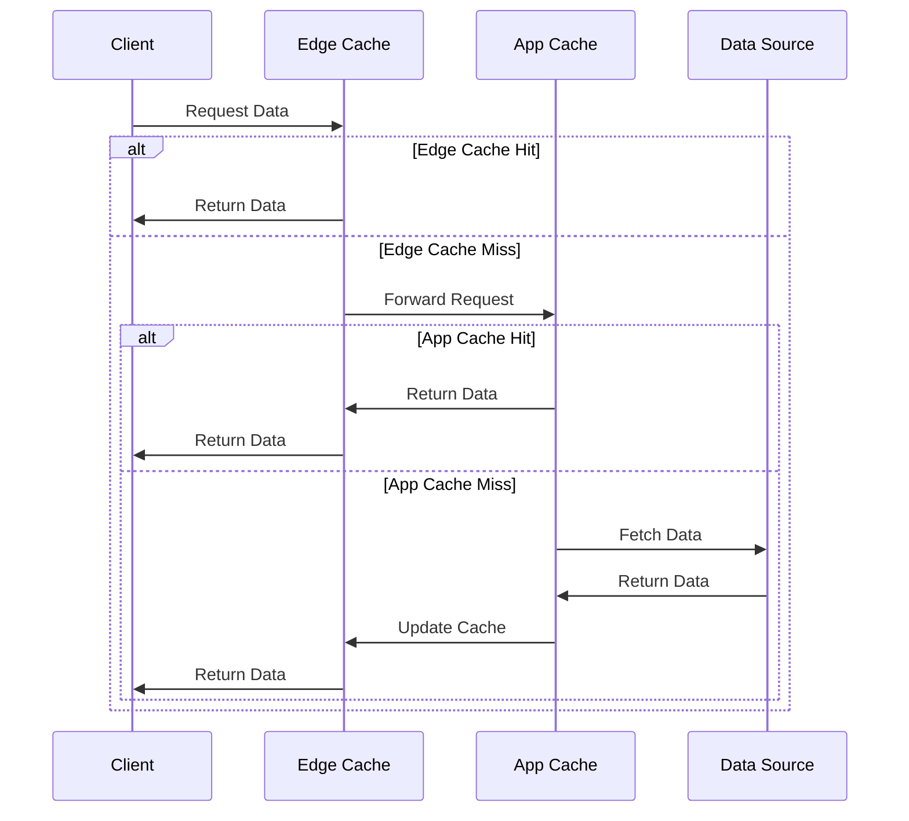

### 4.2 Performance Monitoring

Performance monitoring tracks system metrics to maintain optimal performance and identify improvement opportunities.

**Monitoring Value:**
- Real-time insights
- Issue prevention
- Resource optimization
- User experience improvement

**Key Metrics:**
- Response times
- Resource utilization
- Error rates
- User satisfaction

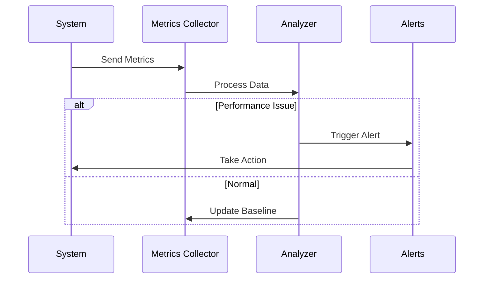

## 5. Development Workflow

The development workflow ensures efficient code delivery while maintaining quality and reliability standards.

### 5.1 CI/CD Pipeline

The CI/CD pipeline automates code deployment while ensuring quality and reliability through automated testing and validation.

**Process Benefits:**
- Automated deployment
- Quality assurance
- Fast delivery
- Risk reduction

**Pipeline Features:**
- Automated testing
- Quality gates
- Deployment automation
- Rollback capability

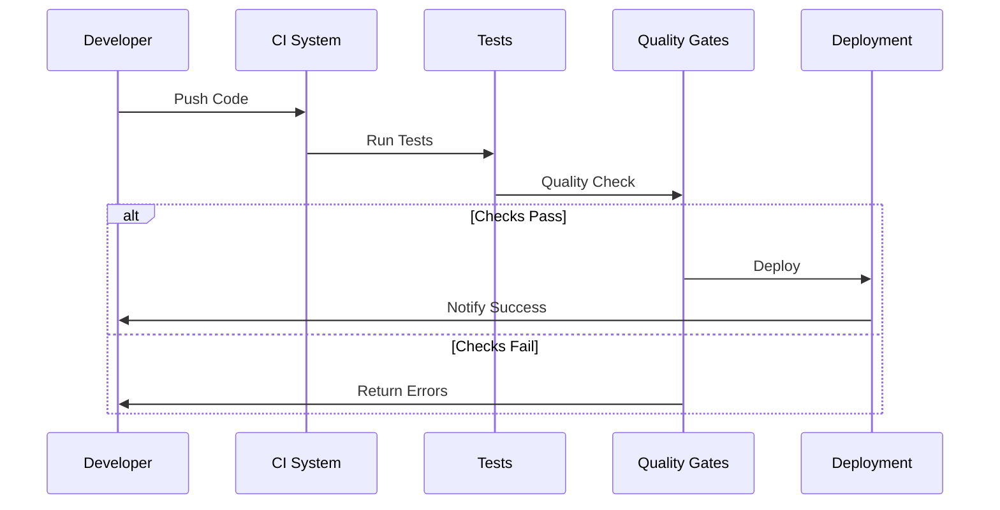

### 5.2 Feature Development

The feature development process ensures consistent code quality and efficient collaboration among development teams.

**Development Benefits:**
- Code quality
- Team collaboration
- Fast iteration
- Reliable delivery

**Process Features:**
- Code review
- Automated testing
- Quality checks
- Team coordination

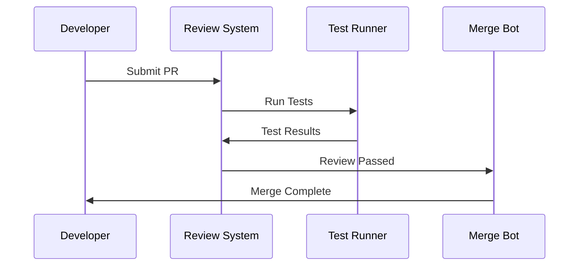

## 6. Security Implementation

Security implementation ensures platform and data protection through comprehensive security measures.

### 6.1 Request Security

The request security system protects platform APIs and services from unauthorized access and abuse.

**Security Benefits:**
- Access control
- Attack prevention
- Resource protection
- Usage monitoring

**Protection Features:**
- Authentication
- Rate limiting
- Threat detection
- Access logging

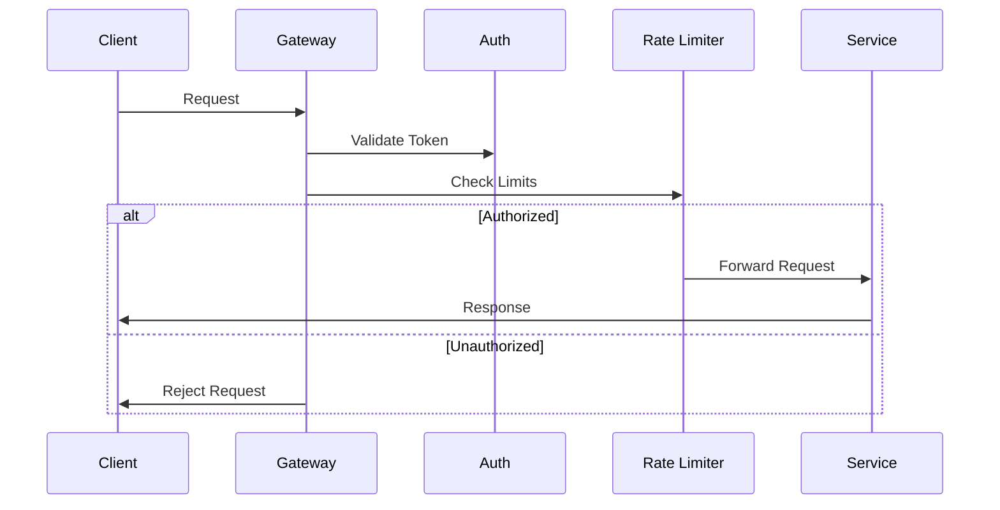

### 6.2 Data Security

Data security ensures protection of user data and platform assets through encryption and access control.

**Security Value:**
- Data protection
- Privacy compliance
- Access control
- Risk mitigation

**Security Features:**
- Data encryption
- Access control
- Audit logging
- Compliance monitoring

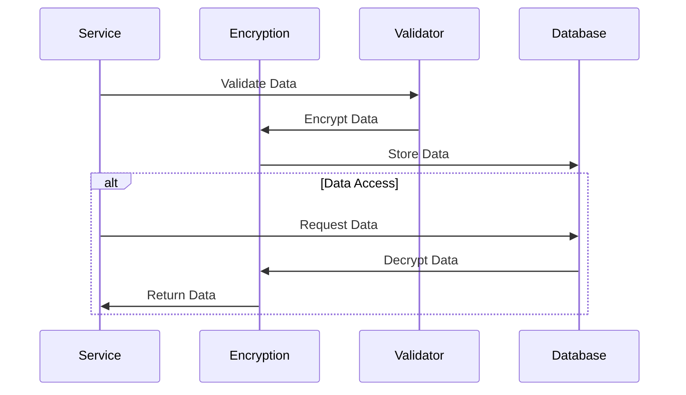

## 7. Real-time Collaboration

Real-time collaboration features enable multiple users to work together on projects simultaneously.

### 7.1 Presence System

The presence system tracks user activity and availability within the platform.

**System Benefits:**
- Real-time user status
- Activity indicators
- Collaboration awareness
- Conflict prevention

**Key Features:**
- User presence tracking
- Activity status
- Last seen information
- Typing indicators

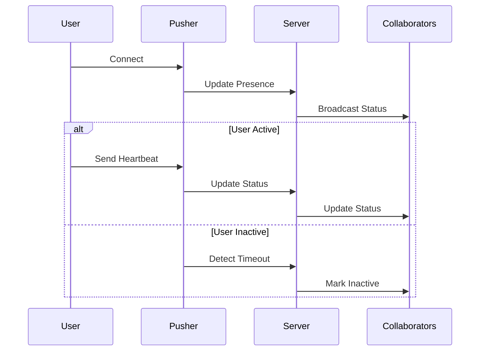

### 7.2 State Synchronization

The state synchronization system ensures consistent data across all connected clients.

**System Benefits:**
- Real-time updates
- Conflict resolution
- Data consistency
- Offline support

**Key Features:**
- CRDT-based sync
- Automatic conflict resolution
- Change tracking
- History management

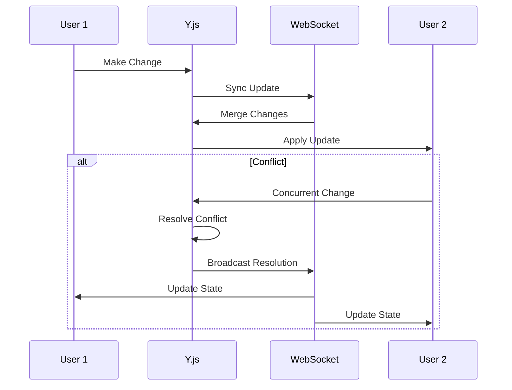

**Implementation Details:**

1. **Connection Management**
```typescript
interface ConnectionState {
    userId: string;
    status: 'online' | 'away' | 'offline';
    lastSeen: Date;
    activity?: {
        type: 'viewing' | 'editing' | 'commenting';
        resourceId: string;
        timestamp: Date;
    };
}
```

2. **Synchronization Protocol**
```typescript
interface SyncMessage {
    type: 'update' | 'sync' | 'ack';
    payload: {
        version: number;
        changes: Array<Change>;
        timestamp: Date;
        origin: string;
    };
}
```

3. **Conflict Resolution**
```typescript
interface ConflictResolution {
    strategy: 'merge' | 'last-write-wins' | 'manual';
    resolution: {
        winner: Change;
        conflicts: Array<Change>;
        metadata: Record<string, any>;
    };
}
```

_Last updated: 2024-03-27_ 