# User Workflows

## Overview

This document describes user-facing workflows in the Moodboard platform, focusing on the end-user experience and interaction patterns. Each workflow is designed to provide an intuitive, seamless experience while ensuring robust functionality and data integrity.

## 1. Authentication Flows

The authentication system provides secure and convenient access to the platform while maintaining a smooth user experience. It supports both traditional email/password authentication and OAuth options.

### 1.1 Registration Process

The registration process is invitation-based to ensure controlled platform growth and maintain service quality. This approach helps create an exclusive environment while ensuring high-quality user engagement.

**Process Description:**
1. Users receive a unique invitation code through email
2. The code is validated during registration
3. Users provide essential information and verify their email
4. Profile setup includes basic preferences and initial settings

**Key Considerations:**
- Invitation codes have expiration dates
- Email verification is required
- Password requirements follow security best practices
- Profile information can be completed gradually

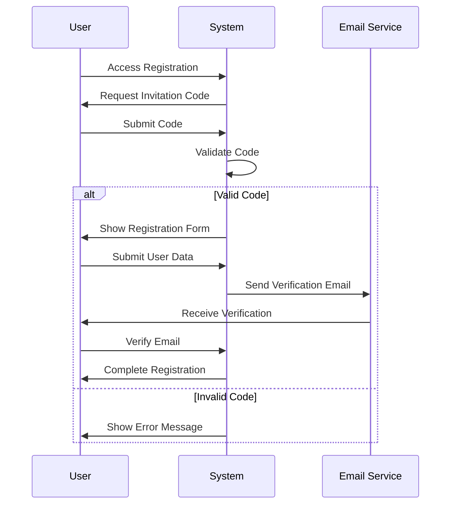
```mermaid
sequenceDiagram
    participant U as User
    participant S as System
    participant E as Email Service
    
    U->>S: Access Registration
    S->>U: Request Invitation Code
    U->>S: Submit Code
    S->>S: Validate Code
    
    alt Valid Code
        S->>U: Show Registration Form
        U->>S: Submit User Data
        S->>E: Send Verification Email
        E->>U: Receive Verification
        U->>S: Verify Email
        S->>U: Complete Registration
    else Invalid Code
        S->>U: Show Error Message
    end
```

### 1.2 Login Process

The login system provides multiple authentication methods while maintaining security and user convenience. It includes features for both regular users and those using OAuth providers.

**Process Description:**
1. Users can choose between traditional login or OAuth
2. Multiple failed attempts trigger security measures
3. Session management includes remember-me functionality
4. Password recovery options are readily available

**Security Features:**
- Rate limiting for failed attempts
- Secure session management
- Two-factor authentication option
- Concurrent session handling

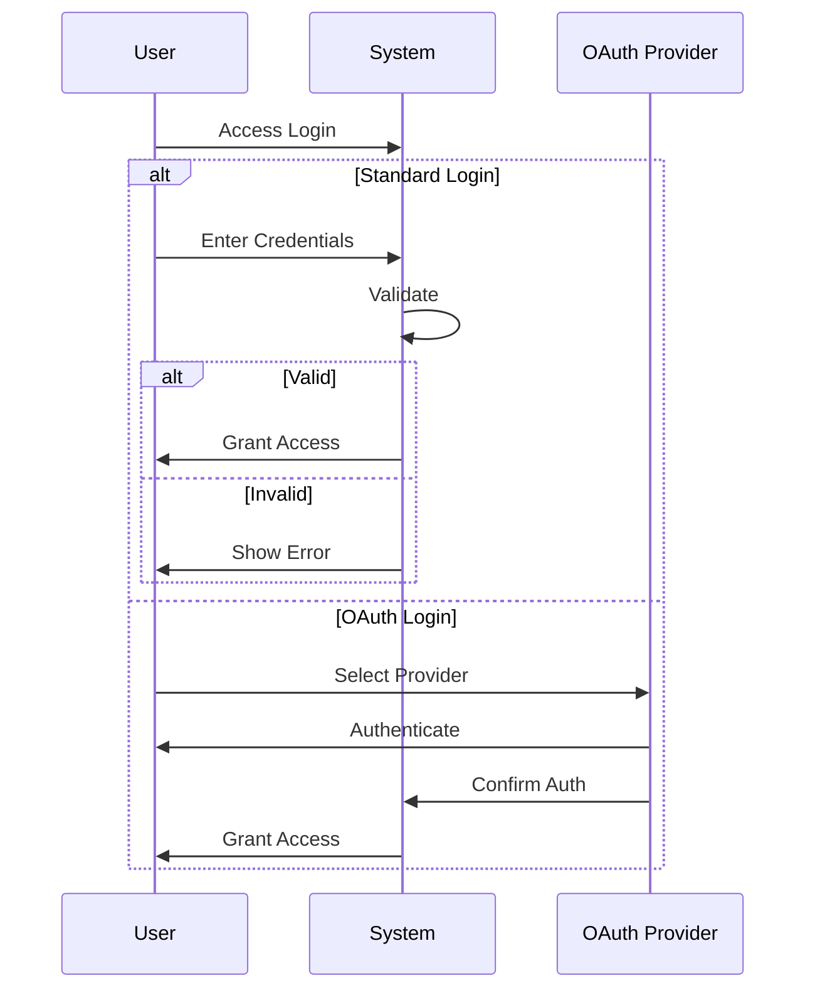
```mermaid
sequenceDiagram
    participant U as User
    participant S as System
    participant Auth as OAuth Provider
    
    U->>S: Access Login
    
    alt Standard Login
        U->>S: Enter Credentials
        S->>S: Validate
        alt Valid
            S->>U: Grant Access
        else Invalid
            S->>U: Show Error
        end
    else OAuth Login
        U->>Auth: Select Provider
        Auth->>U: Authenticate
        Auth->>S: Confirm Auth
        S->>U: Grant Access
    end
```

## 2. Project Management

Project management workflows enable users to organize and manage their design projects efficiently, from initial creation through completion.

### 2.1 Project Creation

The project creation wizard guides users through a structured process to set up their design projects. This step-by-step approach ensures all necessary information is collected while maintaining an intuitive experience.

**Process Description:**
1. **Basic Information Setup**
   - Project name and description
   - Visibility settings (public/private)
   - Project tags and categories
   - Initial timeline settings

2. **Style Definition**
   - Overall design style selection
   - Color scheme preferences
   - Material preferences
   - Lighting preferences

3. **Space Planning**
   - Room type selection
   - Space configuration
   - Measurements and constraints
   - Special requirements

**Key Features:**
- Template-based quick start
- Style preference visualization
- Budget consideration
- Automatic style guide generation

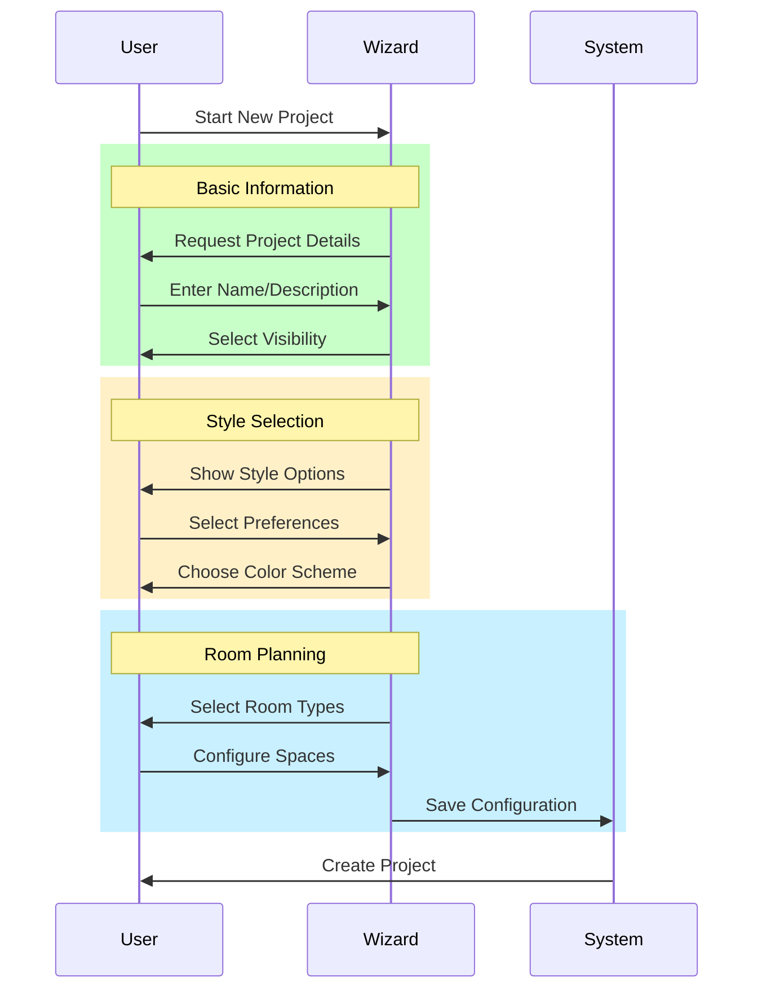
```mermaid
sequenceDiagram
    participant U as User
    participant W as Wizard
    participant S as System
    
    U->>W: Start New Project
    
    rect rgb(200, 255, 200)
        Note over U,W: Basic Information
        W->>U: Request Project Details
        U->>W: Enter Name/Description
        W->>U: Select Visibility
    end
    
    rect rgb(255, 240, 200)
        Note over U,W: Style Selection
        W->>U: Show Style Options
        U->>W: Select Preferences
        W->>U: Choose Color Scheme
    end
    
    rect rgb(200, 240, 255)
        Note over U,W: Room Planning
        W->>U: Select Room Types
        U->>W: Configure Spaces
        W->>S: Save Configuration
    end
    
    S->>U: Create Project
```

### 2.2 Room Management

Room management allows users to organize and customize individual spaces within their projects. Each room can be configured with specific requirements and style preferences.

**Process Description:**
1. Room type selection from taxonomy
2. Space configuration and measurements
3. Style preferences specific to the room
4. Feature and requirement specification

**Room Customization Options:**
- Layout selection
- Lighting preferences
- Material choices
- Furniture placement
- Color schemes

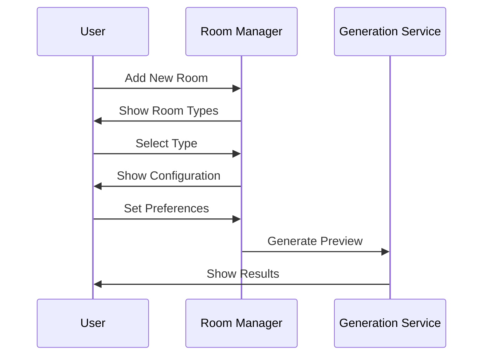
```mermaid
sequenceDiagram
    participant U as User
    participant R as Room Manager
    participant G as Generation Service
    
    U->>R: Add New Room
    R->>U: Show Room Types
    U->>R: Select Type
    R->>U: Show Configuration
    U->>R: Set Preferences
    R->>G: Generate Preview
    G->>U: Show Results
```

## 3. Design Generation

The design generation process combines user preferences with AI capabilities to create personalized design solutions.

### 3.1 Idea Exploration

The idea exploration system helps users discover and refine design concepts through an interactive process.

**Process Description:**
1. Browse categorized design ideas
2. Filter by style, room type, and features
3. Save and organize favorite concepts
4. Customize selected ideas

**Exploration Features:**
- Visual style guides
- Similar design suggestions
- Style mixing options
- Favorite collections

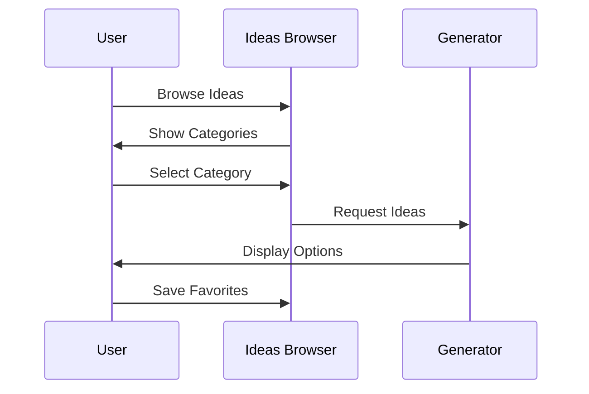
```mermaid
sequenceDiagram
    participant U as User
    participant I as Ideas Browser
    participant G as Generator
    
    U->>I: Browse Ideas
    I->>U: Show Categories
    U->>I: Select Category
    I->>G: Request Ideas
    G->>U: Display Options
    U->>I: Save Favorites
```

### 3.2 Design Customization

Design customization allows users to refine and personalize generated designs to match their specific needs.

**Process Description:**
1. Select base design from generated options
2. Modify individual elements
3. Adjust color schemes and materials
4. Fine-tune lighting and layout

**Customization Options:**
- Color palette adjustment
- Material substitution
- Furniture arrangement
- Lighting modification
- Accessory selection

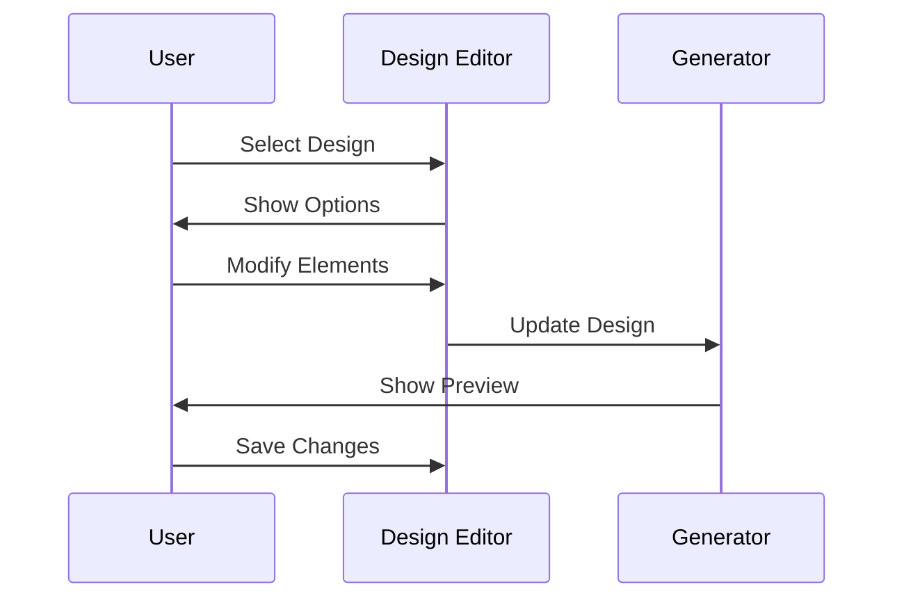
```mermaid
sequenceDiagram
    participant U as User
    participant D as Design Editor
    participant G as Generator
    
    U->>D: Select Design
    D->>U: Show Options
    U->>D: Modify Elements
    D->>G: Update Design
    G->>U: Show Preview
    U->>D: Save Changes
```

## 4. Collaboration Features

Collaboration tools enable team work and feedback collection for design projects.

### 4.1 Sharing Projects

The sharing system allows users to collaborate with team members, clients, or other stakeholders while maintaining appropriate access control.

**Process Description:**
1. Set sharing permissions
2. Invite collaborators
3. Manage access levels
4. Track collaboration activity

**Sharing Options:**
- View-only access
- Comment permissions
- Edit capabilities
- Time-limited sharing

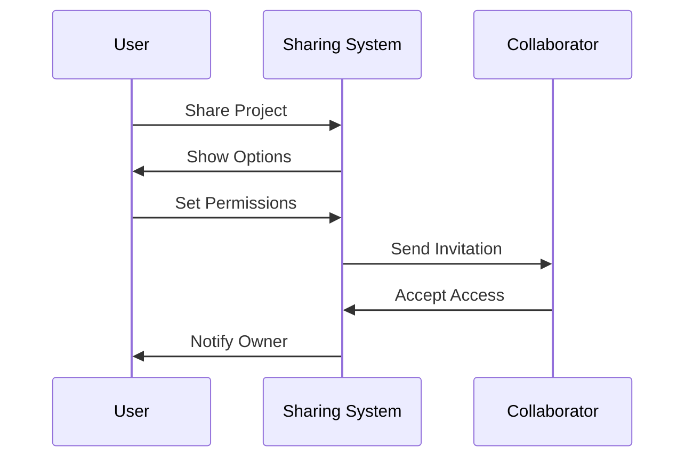
```mermaid
sequenceDiagram
    participant U as User
    participant S as Sharing System
    participant C as Collaborator
    
    U->>S: Share Project
    S->>U: Show Options
    U->>S: Set Permissions
    S->>C: Send Invitation
    C->>S: Accept Access
    S->>U: Notify Owner
```

### 4.2 Feedback Collection

The feedback system enables structured collection and organization of input from stakeholders.

**Process Description:**
1. Request feedback on specific designs
2. Collect structured ratings
3. Gather detailed comments
4. Track feedback implementation

**Feedback Features:**
- Rating categories
- Comment threading
- Change tracking
- Resolution status

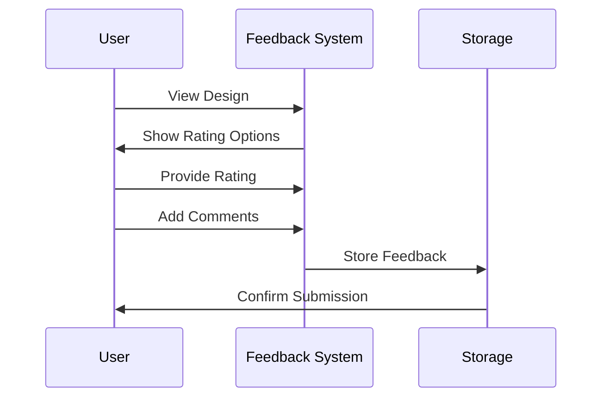
```mermaid
sequenceDiagram
    participant U as User
    participant F as Feedback System
    participant S as Storage
    
    U->>F: View Design
    F->>U: Show Rating Options
    U->>F: Provide Rating
    U->>F: Add Comments
    F->>S: Store Feedback
    S->>U: Confirm Submission
```

## 5. Export and Integration

Export and integration features allow users to utilize their designs across different platforms and formats.

### 5.1 Export Process

The export system supports multiple format options and quality settings for different use cases.

**Process Description:**
1. Select export format
2. Choose quality settings
3. Add metadata and annotations
4. Generate and download files

**Export Options:**
- High-resolution images
- PDF documents
- 3D model exports
- Material specifications

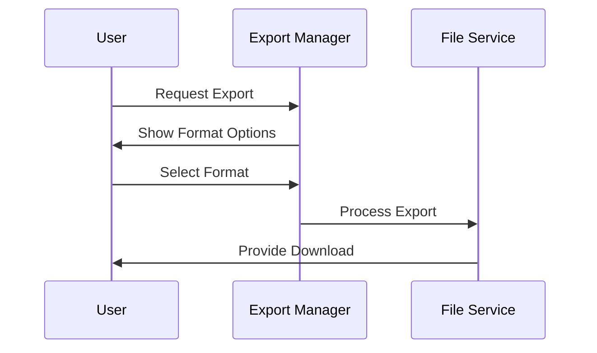
```mermaid
sequenceDiagram
    participant U as User
    participant E as Export Manager
    participant F as File Service
    
    U->>E: Request Export
    E->>U: Show Format Options
    U->>E: Select Format
    E->>F: Process Export
    F->>U: Provide Download
```

### 5.2 External Integration

Integration capabilities allow seamless connection with external design and project management tools.

**Process Description:**
1. Select integration service
2. Authorize connection
3. Configure sync settings
4. Manage ongoing integration

**Integration Features:**
- Miro/Figma integration
- Project management tools
- Document management systems
- Vendor platforms

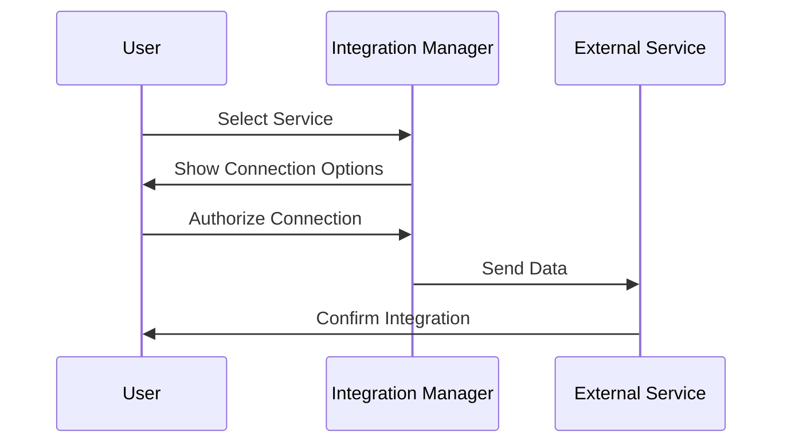
```mermaid
sequenceDiagram
    participant U as User
    participant I as Integration Manager
    participant E as External Service
    
    U->>I: Select Service
    I->>U: Show Connection Options
    U->>I: Authorize Connection
    I->>E: Send Data
    E->>U: Confirm Integration
```

## 6. Professional Tools

Professional tools provide advanced features for detailed design work and project management.

### 6.1 Measurements and Estimates

The measurement system enables accurate space planning and cost estimation.

**Process Description:**
1. Input space measurements
2. Define material quantities
3. Calculate cost estimates
4. Generate specifications

**Tool Features:**
- Area calculations
- Material quantity takeoffs
- Cost estimation
- Specification generation

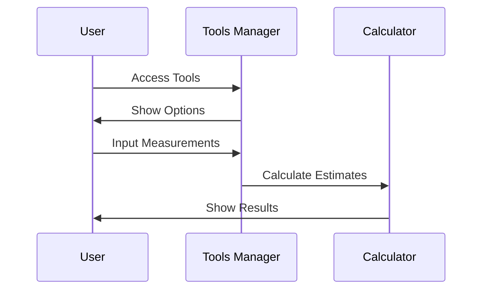
```mermaid
sequenceDiagram
    participant U as User
    participant T as Tools Manager
    participant C as Calculator
    
    U->>T: Access Tools
    T->>U: Show Options
    U->>T: Input Measurements
    T->>C: Calculate Estimates
    C->>U: Show Results
```

### 6.2 Material Selection

The material selection system helps users choose and specify materials for their projects.

**Process Description:**
1. Browse material categories
2. Filter by specifications
3. Check availability
4. Request samples

**Selection Features:**
- Material comparisons
- Sustainability ratings
- Cost analysis
- Vendor information

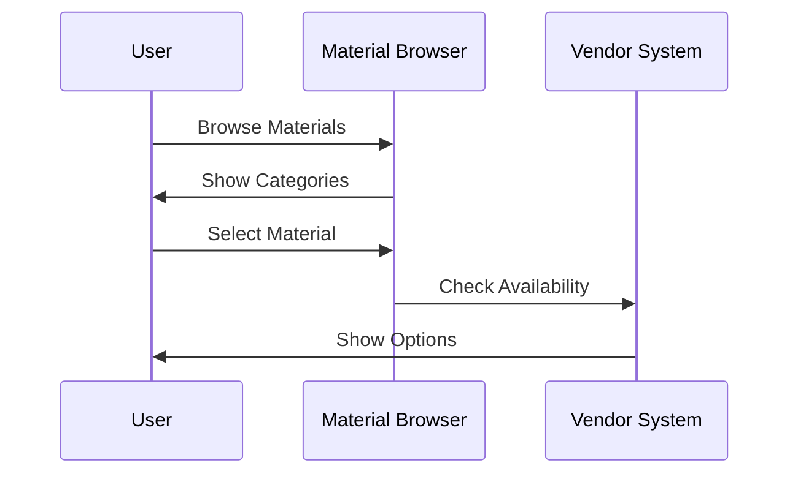
```mermaid
sequenceDiagram
    participant U as User
    participant M as Material Browser
    participant V as Vendor System
    
    U->>M: Browse Materials
    M->>U: Show Categories
    U->>M: Select Material
    M->>V: Check Availability
    V->>U: Show Options
```

## 7. History Management

The history management system provides a comprehensive view of all user activities and generated content, enabling easy access and interaction with past work.

### 7.1 Generation History

The generation history provides a visual timeline of all generated designs and associated content, allowing users to track and revisit their creative process.

**Process Description:**
1. Access history timeline at the bottom of the screen
2. View thumbnails of all generated images
3. Select and interact with historical items
4. Review associated descriptions and comments

**Key Features:**
- Visual timeline navigation
- Thumbnail previews
- Quick access to full-size views
- Associated metadata display

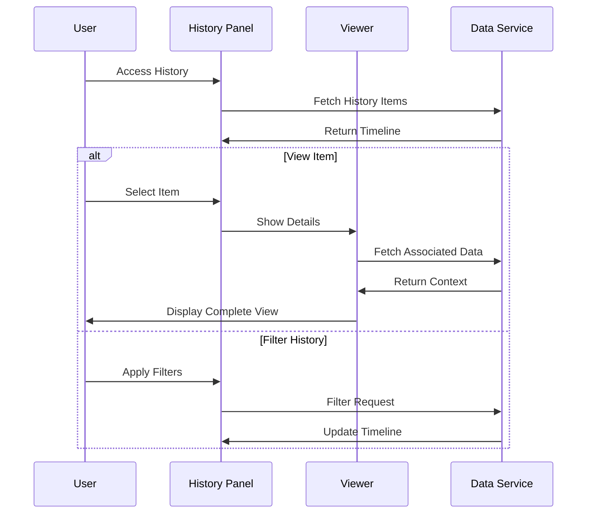
```mermaid
sequenceDiagram
    participant U as User
    participant H as History Panel
    participant V as Viewer
    participant D as Data Service
    
    U->>H: Access History
    H->>D: Fetch History Items
    D->>H: Return Timeline
    
    alt View Item
        U->>H: Select Item
        H->>V: Show Details
        V->>D: Fetch Associated Data
        D->>V: Return Context
        V->>U: Display Complete View
    else Filter History
        U->>H: Apply Filters
        H->>D: Filter Request
        D->>H: Update Timeline
    end
```

### 7.2 Context Management

The context management system allows users to view and interact with all elements associated with each generated design, including descriptions, comments, and spending information.

**Process Description:**
1. Select historical item
2. View associated descriptions
3. Access generation context
4. Review spending details

**Context Features:**
- Generated descriptions
- User comments
- Spending records
- Generation parameters

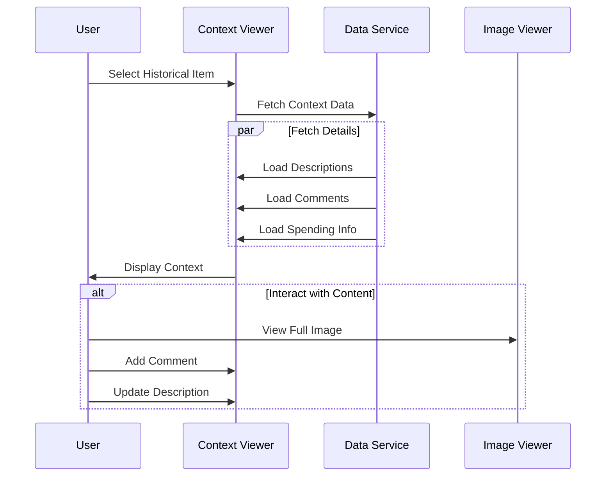
```mermaid
sequenceDiagram
    participant U as User
    participant C as Context Viewer
    participant D as Data Service
    participant I as Image Viewer
    
    U->>C: Select Historical Item
    C->>D: Fetch Context Data
    
    par Fetch Details
        D->>C: Load Descriptions
        D->>C: Load Comments
        D->>C: Load Spending Info
    end
    
    C->>U: Display Context
    
    alt Interact with Content
        U->>I: View Full Image
        U->>C: Add Comment
        U->>C: Update Description
    end
```

### 7.3 History Interaction

The history interaction system enables users to work with historical content in the main generation area, facilitating iteration and improvement of designs.

**Process Description:**
1. Select historical design
2. Load in main workspace
3. Modify or iterate design
4. Track version history

**Interaction Options:**
- Design modification
- Version comparison
- Parameter adjustment
- Context reuse

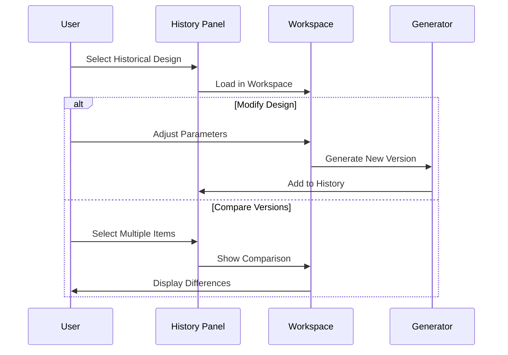
```mermaid
sequenceDiagram
    participant U as User
    participant H as History Panel
    participant W as Workspace
    participant G as Generator
    
    U->>H: Select Historical Design
    H->>W: Load in Workspace
    
    alt Modify Design
        U->>W: Adjust Parameters
        W->>G: Generate New Version
        G->>H: Add to History
    else Compare Versions
        U->>H: Select Multiple Items
        H->>W: Show Comparison
        W->>U: Display Differences
    end
```

_Last updated: 2024-03-27_ 