# Moodboard Workflows

## Overview

This document describes the core workflows and processes within the Moodboard platform. Each workflow is designed to optimize user experience while maintaining system performance and quality standards.

## User Workflows

### 1. Authentication Flows

The authentication system consists of three distinct but interconnected processes: invitation flow, user registration flow, and login flow. Each process serves a specific purpose in ensuring secure and controlled access to the platform.

#### 1.1 Invitation Flow

The invitation system controls platform access and growth through a managed invitation process. This helps maintain service quality and prevent abuse while creating an exclusive environment.

**Key Steps:**

- Admin generates invitation codes
- System sends invitation emails
- User receives unique invitation code
- Code validation during registration
- Tracking invitation usage and conversion

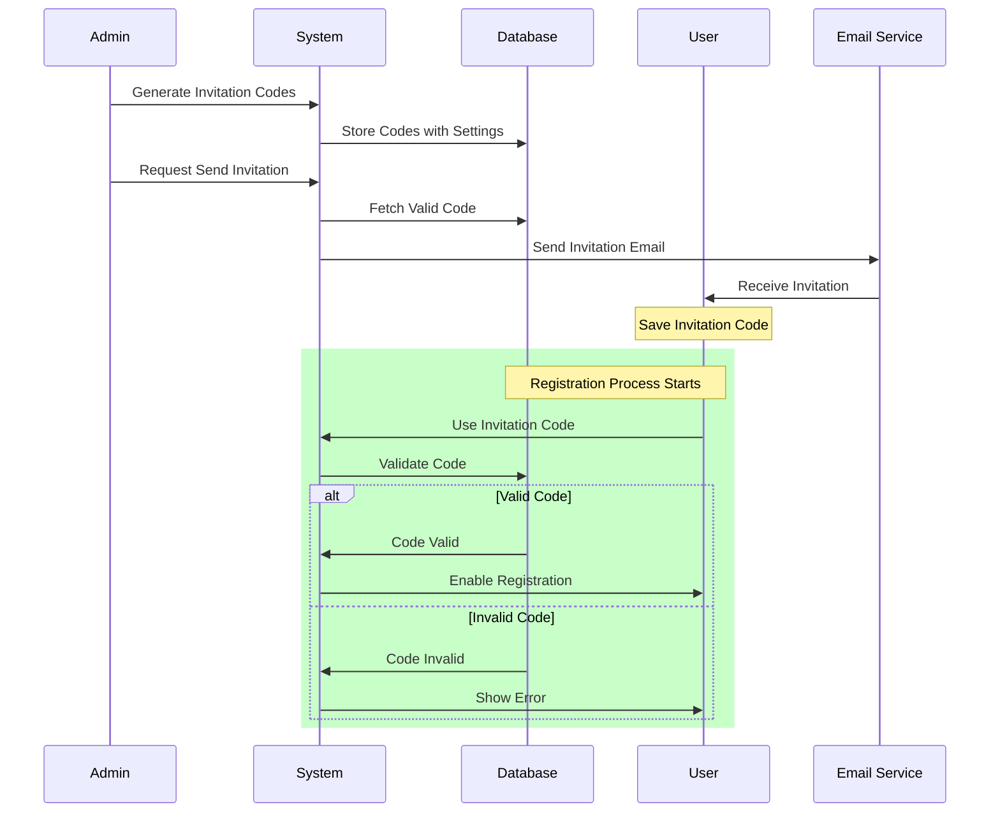

#### 1.2 User Registration Flow

The registration process ensures secure account creation while collecting necessary user information. It includes email verification and profile setup steps.

**Key Steps:**
- Invitation code validation
- Email and password validation
- User profile information collection
- Email verification
- Terms acceptance
- Initial preferences setup

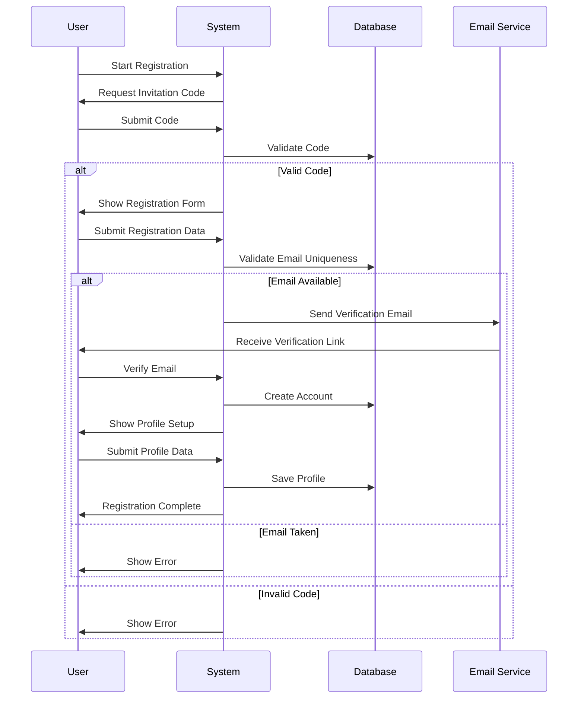

#### 1.3 User Login Flow

The login process provides secure authentication while offering multiple login methods and handling various edge cases like password recovery and account lockout.

**Key Steps:**
- Multiple authentication methods
- Secure credential validation
- Session management
- Rate limiting for security
- Remember me functionality
- Password recovery options

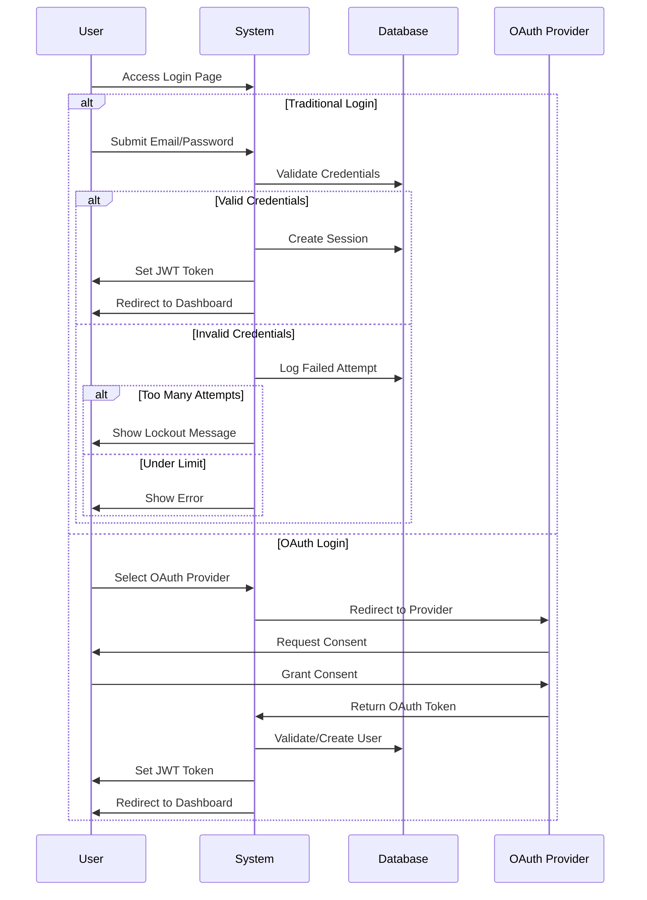

**Security Considerations:**

1. **Rate Limiting:**
   - Maximum 5 failed attempts per 15 minutes
   - Account lockout for 30 minutes after failed attempts
   - IP-based rate limiting for registration attempts

2. **Password Requirements:**
   - Minimum 8 characters
   - At least one uppercase letter
   - At least one number
   - At least one special character
   - Password history check (last 3 passwords)

3. **Session Management:**
   - JWT token expiration after 24 hours
   - Refresh token rotation
   - Concurrent session handling
   - Secure cookie settings

4. **Email Verification:**
   - Time-limited verification links (24 hours)
   - Resend verification option
   - Verification status tracking

5. **OAuth Security:**
   - Strict state parameter validation
   - Scope limitations
   - Token security measures
   - Provider-specific security settings

### 2. Project Creation Flow

The project creation workflow guides users through a structured wizard-based process. The wizard helps users define project characteristics and preferences before adding specific rooms. This approach ensures all necessary information is collected systematically while maintaining an intuitive user experience.

#### 2.1 Project Initialization Wizard

**Step 1: Basic Project Information**
- Project name (required)
- Project description (optional)
- Project visibility (public/private)
- Project tags for organization

**Step 2: Style Preferences**
- Overall design style selection
  - Modern
  - Contemporary
  - Traditional
  - Industrial
  - Scandinavian
  - Minimalist
  - etc.
- Furniture style preferences
  - Material preferences
  - Form preferences
  - Era/period preferences
- Color scheme selection
  - Primary colors
  - Accent colors
  - Material finishes

**Step 3: Additional Preferences**
- Budget considerations
- Timeline expectations
- Specific requirements or constraints
- Inspiration references (optional)
- Notes and special instructions

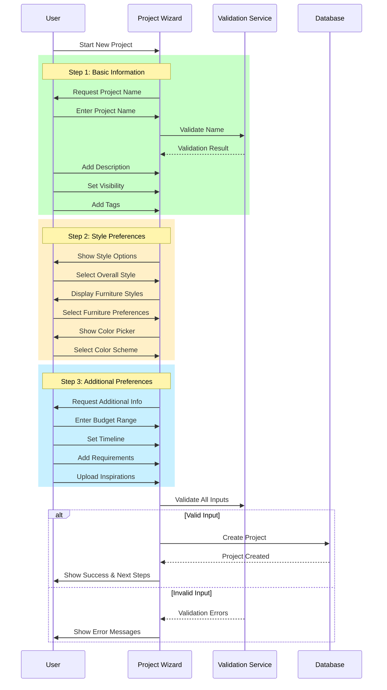

#### 2.2 Project Structure

After project creation, the system establishes the following structure:

```typescript
interface Project {
    id: string;
    name: string;
    description?: string;
    visibility: 'public' | 'private';
    tags: string[];
    
    stylePreferences: {
        overallStyle: string;
        furnitureStyle: {
            materials: string[];
            forms: string[];
            era: string;
        };
        colorScheme: {
            primary: string[];
            accent: string[];
            finishes: string[];
        };
    };
    
    additionalPreferences: {
        budget?: {
            min: number;
            max: number;
            currency: string;
        };
        timeline?: {
            start: Date;
            deadline?: Date;
        };
        requirements: string[];
        inspirationUrls?: string[];
        notes?: string;
    };
    
    rooms: Room[];
    createdAt: Date;
    updatedAt: Date;
    userId: string;
}
```

#### 2.3 Room Addition Flow

After project creation, users can start adding rooms:

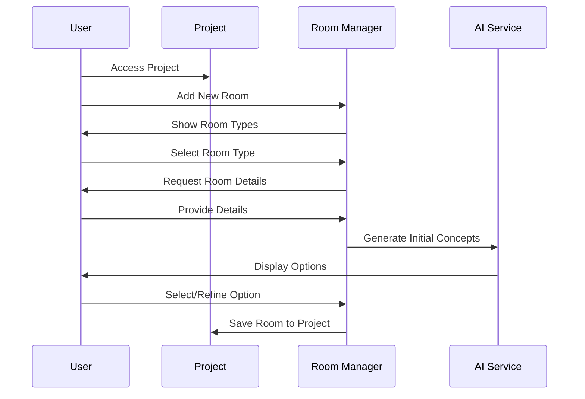

**Room Types Hierarchy:**

```
- Living Spaces
  ├── Living Room
  ├── Family Room
  ├── Den
  └── Home Theater
- Kitchen Spaces
  ├── Main Kitchen
  ├── Kitchen with Dining
  └── Kitchenette
- Bedroom Spaces
  ├── Master Bedroom
  ├── Guest Bedroom
  └── Children's Bedroom
- Bathroom Spaces
  ├── Master Bathroom
  ├── Guest Bathroom
  └── Powder Room
- Utility Spaces
  ├── Home Office
  ├── Laundry Room
  └── Storage Room
```

**Key Features:**
1. **Project Management**
   - Project overview dashboard
   - Progress tracking
   - Room status monitoring
   - Budget tracking
   - Timeline visualization

2. **Style Consistency**
   - Style guide generation
   - Color palette management
   - Material coordination
   - Design element tracking

3. **Collaboration**
   - Share project with collaborators
   - Comment on specific elements
   - Version history
   - Export options

4. **AI Integration**
   - Style recommendations
   - Furniture suggestions
   - Color scheme generation
   - Layout optimization

### 3. Image Generation Flow

The image generation process is built on three key components: Room, Space, and Ideas. Each component plays a specific role in creating detailed and contextually relevant interior visualizations.

#### 3.1 Room and Space Management

```typescript
// Taxonomy-driven type system
type TaxonomyId = string;
type AttributeValue = string | number | boolean | object;

interface Taxonomy {
    id: TaxonomyId;
    name: string;
    type: 'room' | 'space' | 'feature' | 'style' | 'material' | 'color';
    attributes: Record<string, AttributeValue>;
    parentId?: TaxonomyId;
    children?: TaxonomyId[];
}

interface Room {
    id: string;
    name: string;
    taxonomyId: TaxonomyId; // References room type in taxonomy
    spaces: Space[];
    ideas: Idea[];
    status: 'draft' | 'in_progress' | 'completed';
    projectId: string;
    attributes: Record<string, AttributeValue>; // Dynamic attributes based on taxonomy
}

interface Space {
    id: string;
    taxonomyId: TaxonomyId; // References space type in taxonomy
    description: SpaceDescription;
    measurements: Record<string, number>; // Dynamic measurements based on taxonomy
    features: SpaceFeature[];
    roomId: string;
    attributes: Record<string, AttributeValue>; // Dynamic attributes based on taxonomy
}

interface SpaceFeature {
    id: string;
    taxonomyId: TaxonomyId; // References feature type in taxonomy
    attributes: Record<string, AttributeValue>; // Dynamic attributes based on taxonomy
}

interface SpaceDescription {
    elements: SpaceElement[]; // Dynamic elements based on taxonomy
    attributes: Record<string, AttributeValue>; // Global space attributes
}

interface SpaceElement {
    taxonomyId: TaxonomyId; // References element type in taxonomy
    description: string;
    attributes: Record<string, AttributeValue>;
}

// Example of how taxonomy drives the structure
interface TaxonomyExample {
    rooms: {
        living_room: {
            allowed_spaces: ['main_area', 'dining_area', 'reading_nook'];
            required_features: ['lighting', 'ventilation'];
            optional_features: ['fireplace', 'built_ins'];
            measurements: ['area', 'height', 'window_area'];
        };
        // Other room types...
    };
    spaces: {
        main_area: {
            required_elements: ['walls', 'floor', 'ceiling'];
            optional_elements: ['windows', 'doors'];
            attributes: ['style', 'color_scheme', 'lighting_level'];
        };
        // Other space types...
    };
    // Other taxonomy categories...
}
```

#### 3.2 Ideas Workflow

The Ideas system provides a structured approach to exploring and refining design concepts for each room, driven by taxonomy-based attributes and rules.

```typescript
interface Idea {
    id: string;
    taxonomyId: TaxonomyId; // References idea type in taxonomy
    spaceDescription: SpaceDescription;
    attributes: Record<string, AttributeValue>; // Dynamic attributes based on taxonomy
    compatibility: {
        roomTypes: TaxonomyId[];
        spaceTypes: TaxonomyId[];
        styles: TaxonomyId[];
    };
}

interface IdeaGeneration {
    sourceType: 'template' | 'custom' | 'ai';
    parameters: {
        taxonomyFilters: TaxonomyId[]; // Filter by taxonomy categories
        attributes: Record<string, AttributeValue>; // Required attributes
        constraints: Record<string, AttributeValue>; // Constraints for generation
    };
}
```

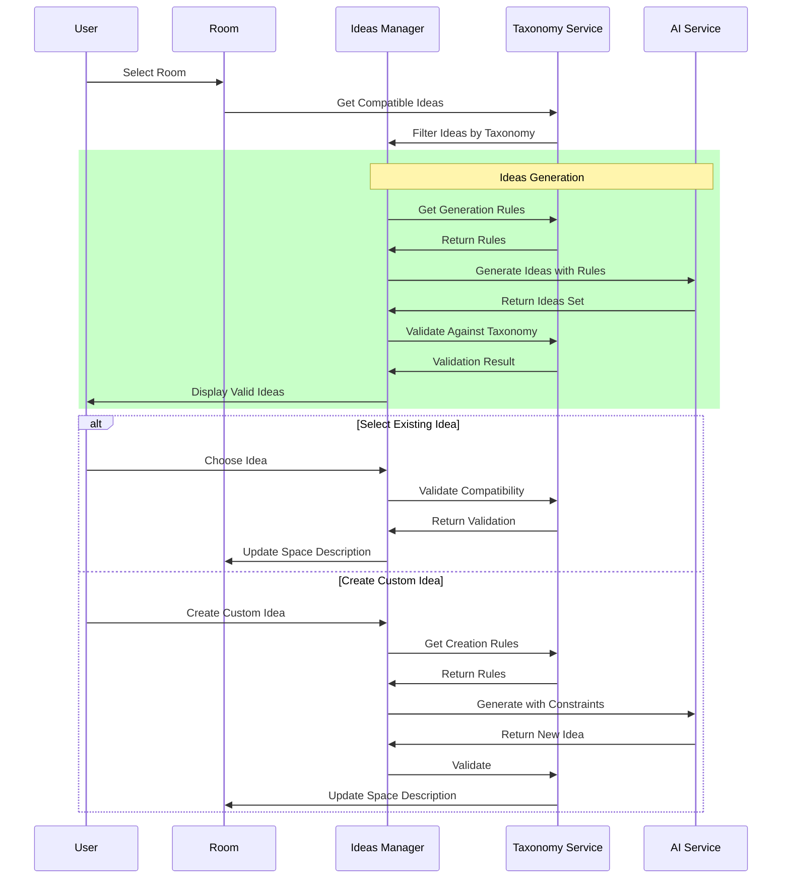

#### 3.3 Space Description Generation

The system uses a taxonomy-driven prompt format to generate consistent and detailed space descriptions:

```typescript
interface GenerationPrompt {
    taxonomyId: TaxonomyId;
    type: 'interior' | 'exterior';
    parameters: {
        style: TaxonomyId;
        roomType: TaxonomyId;
        spaceType: TaxonomyId;
        elements: {
            taxonomyId: TaxonomyId;
            attributes: Record<string, AttributeValue>;
        }[];
    };
    requirements: Record<string, AttributeValue>;
}

interface PromptUpdate {
    type: 'update' | 'initial';
    taxonomyId: TaxonomyId;
    changes: {
        elementUpdates: {
            taxonomyId: TaxonomyId;
            attributes: Record<string, AttributeValue>;
        }[];
        globalAttributes: Record<string, AttributeValue>;
    };
}
```

**Generation Process Flow:**

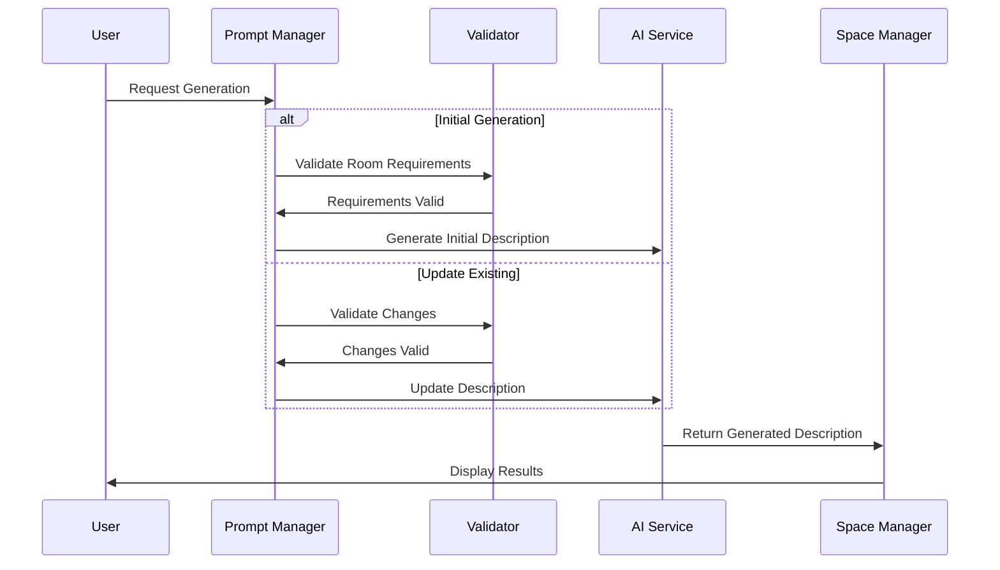

**Key Features:**

1. **Room Management**
   - Room type categorization
   - Space description templates
   - Feature tracking
   - Status management

2. **Ideas System**
   - Idea generation
   - Concept exploration
   - Style matching
   - Reference management

3. **Space Description**
   - Structured prompts
   - Detail validation
   - Style consistency
   - Update management

4. **Integration Points**
   - Project synchronization
   - Style inheritance
   - History tracking
   - Version control

**Processing Rules:**

1. **Initial Generation:**
   - Validate room type and requirements
   - Generate complete space description
   - Apply project style preferences
   - Create initial ideas set

2. **Updates:**
   - Maintain existing structure
   - Update only specified elements
   - Preserve style consistency
   - Track changes history

3. **Ideas Integration:**
   - Match ideas to room type
   - Validate style compatibility
   - Update space descriptions
   - Maintain coherence

**Security and Validation:**

1. **Input Validation:**
   - Required fields checking
   - Style consistency validation
   - Measurement verification
   - Feature compatibility

2. **Output Validation:**
   - Description completeness
   - Style coherence
   - Technical feasibility
   - Quality assurance

## Administrative Workflows

### 1. Invitation Management

The invitation system helps control platform growth and maintain service quality. Administrators can generate and manage invitation codes with specific limitations and monitor their usage patterns.

**Key Steps:**
- Batch code generation with expiry dates
- Usage limitation settings
- Distribution tracking
- Conversion analytics
- Abuse prevention measures

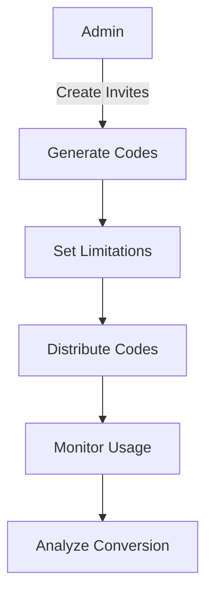

### 2. Resource Monitoring

Continuous monitoring of system resources ensures optimal platform performance and user experience. The process includes tracking usage patterns, managing credits, and implementing proactive resource adjustments.

**Key Steps:**
- Real-time usage tracking
- Credit consumption analysis
- Automated reporting
- Alert system configuration
- Resource optimization

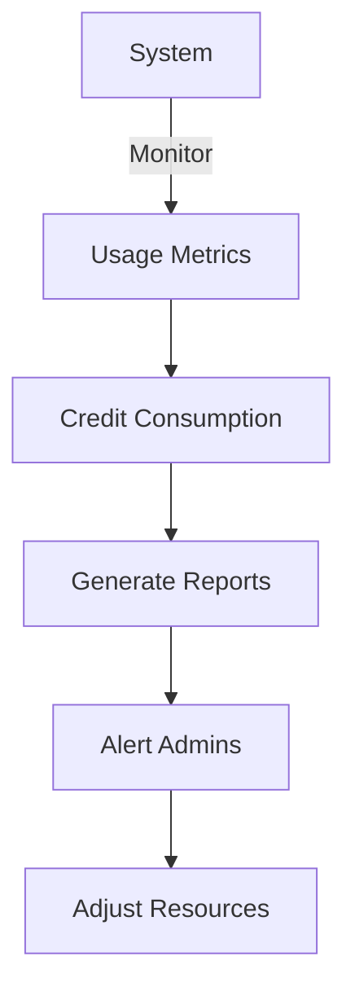

## Development Workflows

### 1. Feature Development Process

Our feature development process follows a structured approach to ensure high-quality, maintainable code while meeting user needs. Each phase has specific deliverables and quality gates.

**Key Deliverables:**
- Detailed technical specifications
- Security and performance considerations
- Test coverage requirements
- Documentation standards
- Review checklists

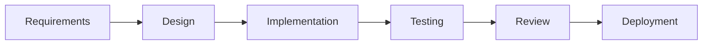

1. **Requirements Phase**
   - Feature specification
   - User story creation
   - Acceptance criteria
   - Priority assignment

2. **Design Phase**
   - Technical design
   - UI/UX mockups
   - Architecture review
   - Security assessment

3. **Implementation Phase**
   - Code development
   - Unit testing
   - Documentation
   - Code review

4. **Testing Phase**
   - Integration testing
   - Performance testing
   - Security testing
   - User acceptance

5. **Review Phase**
   - Code review
   - Design review
   - Performance review
   - Security review

6. **Deployment Phase**
   - Staging deployment
   - Production deployment
   - Monitoring setup
   - Feedback collection

### 2. CI/CD Pipeline

The continuous integration and deployment pipeline automates the build, test, and deployment processes while maintaining code quality and stability.

**Key Features:**
- Automated testing at multiple levels
- Code quality checks
- Security scanning
- Performance benchmarking
- Automated deployments
- Rollback capabilities

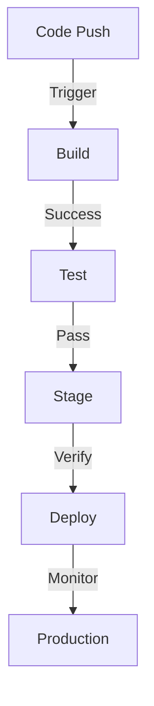

## Maintenance Workflows

### 1. Update Process

The update process ensures system components remain current and secure while minimizing service disruption.

**Key Considerations:**
- Security patch prioritization
- Dependency compatibility
- Update testing protocol
- Rollback procedures
- User communication

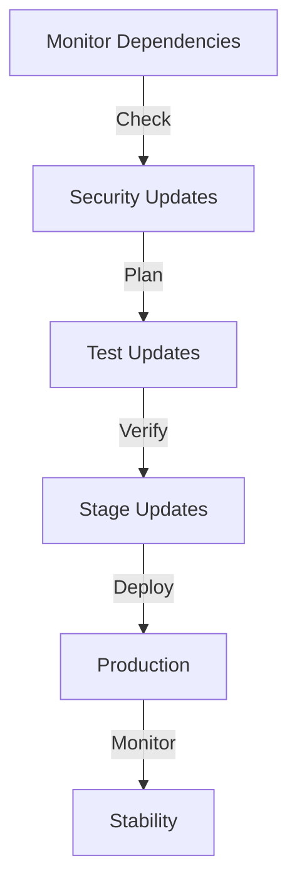

### 2. Backup Process

Our backup strategy ensures data safety and system reliability through regular, tested backups.

**Key Components:**
- Automated daily backups
- Data integrity verification
- Recovery testing schedule
- Retention policies
- Geographic redundancy

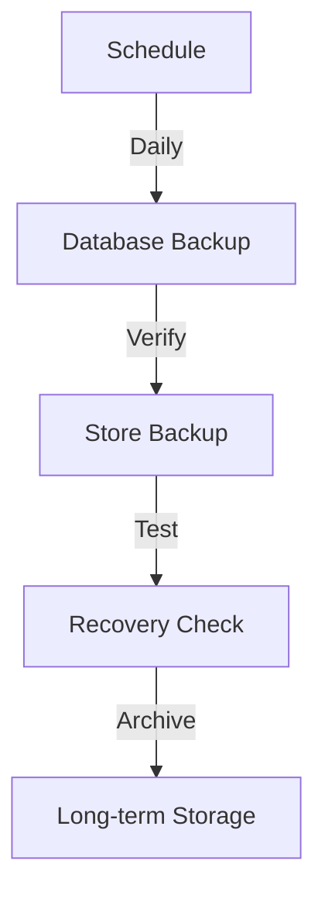

## Error Handling Workflows

### 1. Generation Error Flow

The error handling process for image generation ensures graceful failure recovery and maintains user experience quality.

**Key Aspects:**
- Error categorization
- User communication
- Automatic retry logic
- Admin notifications
- Error pattern analysis

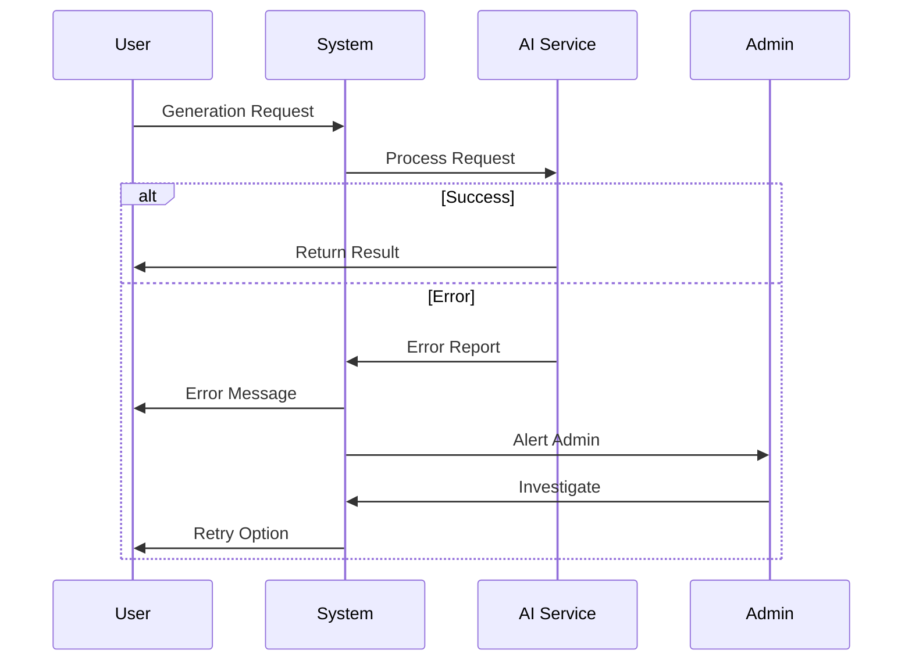

### 2. System Error Flow

System-wide error handling provides structured response to issues based on severity and impact.

**Key Features:**
- Error classification system
- Response time targets
- Escalation procedures
- Resolution tracking
- Post-mortem analysis

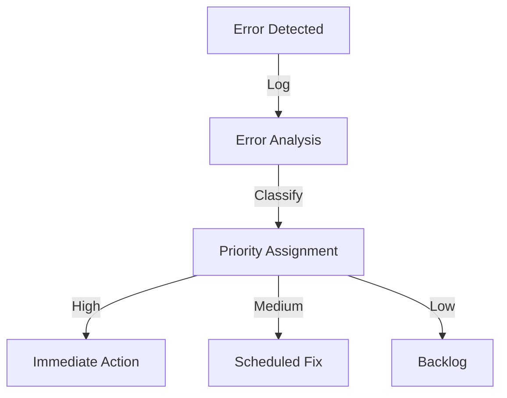

## Feedback Workflows

### 1. User Feedback Process

The feedback collection and processing system ensures user input drives platform improvements.

**Key Elements:**
- Multi-channel feedback collection
- Structured categorization
- Priority assessment
- Response tracking
- Improvement implementation

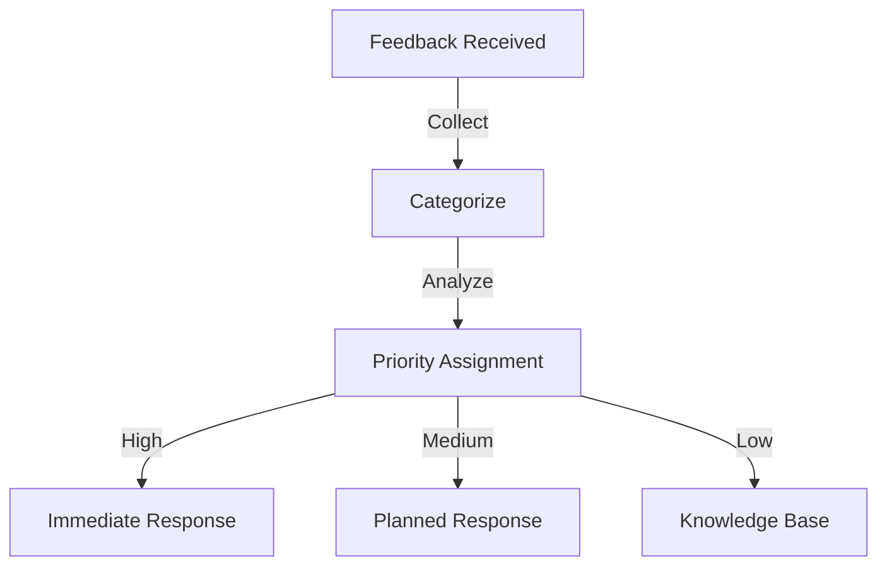

### 2. Quality Improvement Process

Continuous quality improvement processes transform user feedback and system metrics into actionable improvements.

**Key Steps:**
- Data collection and analysis
- Pattern identification
- Solution development
- Implementation planning
- Impact measurement

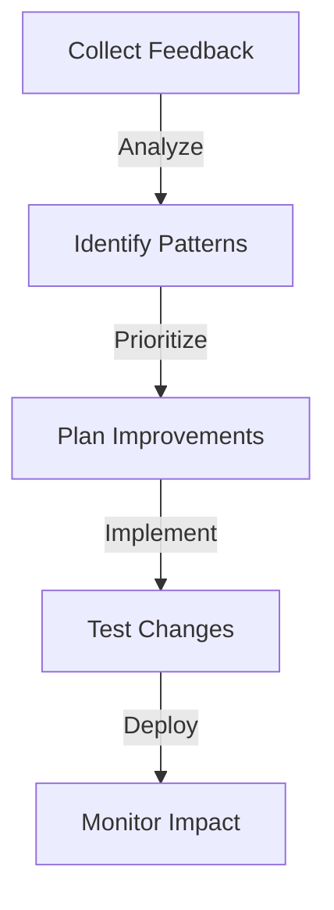

## Performance Monitoring

### 1. System Monitoring

Comprehensive system monitoring ensures optimal platform performance and reliability.

**Key Metrics:**
- Response times
- Error rates
- Resource utilization
- API performance
- Database health

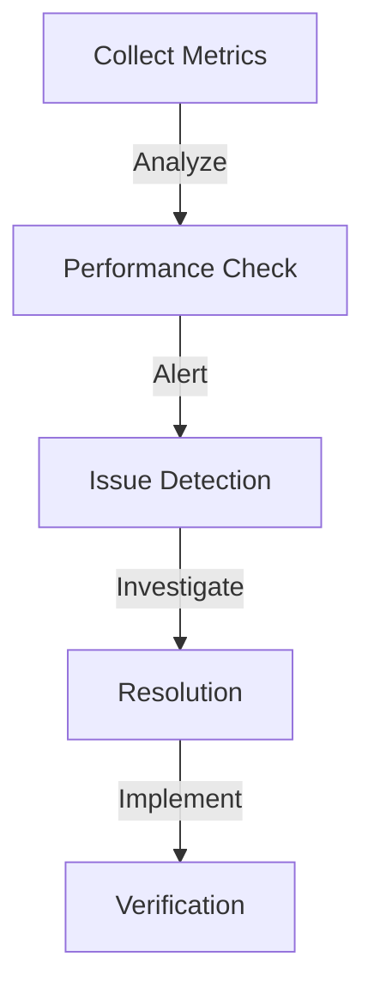

### 2. User Experience Monitoring

Continuous UX monitoring helps identify and address user friction points.

**Key Areas:**
- Page load times
- User flow completion rates
- Error encounters
- Feature usage patterns
- User satisfaction metrics

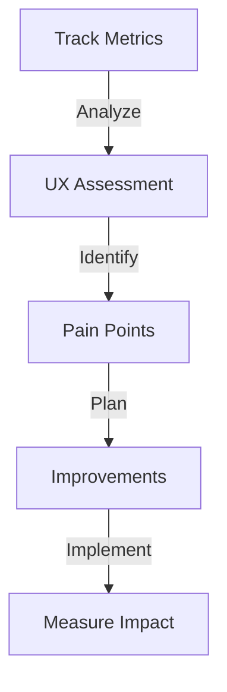

_Last updated: 2024-03-27_
